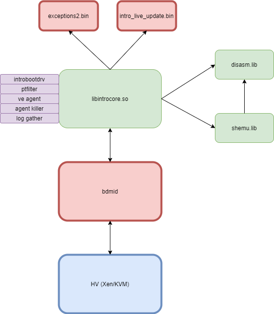
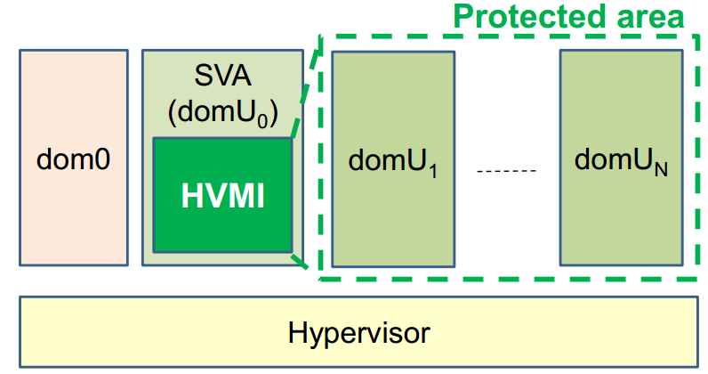
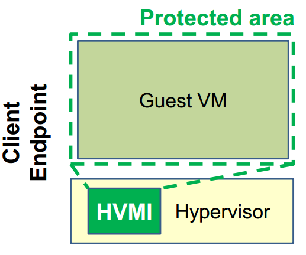

========
Overview
========

Purpose & use-cases
===================

**HVI** stands for **Hypervisor Introspection**. The term is used interchangeably with **HVMI**, which is a bit more specific, and stands for **Hypervisor Memory Introspection**. These terms will be used throughout this documentation to refer to the main introspection logic.

Virtual Machine Introspection is defined as the technique of analyzing the state and behavior of a guest virtual machine from outside of it. In addition, Introspection can also leverage virtualization extensions to provide security.

The main purpose of this project is to provide unmatched security from outside the virtual machine, by leveraging the hardware isolation provided by Intel VT-x. The main categories of attacks HVI prevents are:

- **Binary exploits** inside protected processes
- **Code and data injection** techniques inside protected processes
- **Function hooks** inside protected processes, on designated system DLLs
- **Rootkits** (various techniques are blocked, such as inline hooks inside the kernel or other drivers, SSDT hooks, Driver-object hooks, system register modifications, etc.)
- **Kernel exploits**
- **Privilege escalation**
- **Credentials theft**
- **Deep process introspection** (prevents process creation if the parent process has been compromised)
- **Fileless malware** (powershell command line scanning)

Advantages
----------

- Running a security solution inside the VM leaves it vulnerable to attacks; by running it outside of the VM, the attack surface is reduced
- Better visibility from outside the virtual machine - attackers cannot hide, as HVI has access to the raw, physical memory
- Ability to impose memory or registers access restrictions, via EPT and dedicated VMCS fields
- A single HVI instance/agent can protect multiple virtual machines, thus eliminating the need to install security solutions in every VM
- Intel CPUs are enhanced constantly with virtualization features which aid Introspection, showing that HVI is the future of virtualization-based security, including:

  - Virtualization Exception - #VE
  - VM Functions - VMFUNC
  - Mode-based EPT execution controls
  - Sub-Page Permissions - SPP
  - Hypervisor Linear Address Translations - HLAT

Disadvantages
-------------

- The semantic gap - HVI sees only raw, physical memory, so it has to infer relevant information from it; HVI deals with this by employing invariant signatures and providing periodic updates for new operating systems
- Performance - if not done properly, HVI can induce significant performance impact when intercepting certain memory areas or resources; HVI deals with this by employing several caches and by avoiding to memory protect areas that are accessed frequently - instead, it will integrity protect them
- High complexity - a very good understanding of both hardware and operating system is required; HVI was created by a team of experts in the field, so most of this complexity has been mitigated via proper software engineering
- Relying on undocumented OS features - HVI has to deal with various undocumented areas of the OS, which makes it prone to bugs and instability caused by OS changes. Fortunately, HVI has mechanisms which mitigate these risks, and instead of causing potential issues on an unknown or modified OS, HVI will instead not recognize that particular OS at all

Overall Architecture
====================

The introspection engine is a monolithic, self contained binary, which has no external dependencies. It works in any environment (user-mode or kernel-mode, Windows or Linux, even VMX-Root). The overall architecture is illustrated in the following image:

The components are:

#. **HV** - the hypervisor providing the actual virtualization support to the Introspection engine. For a list of functionalities the HV must expose, please see the section Prerequisites from the HV
#. **hvmid** - the introspection integrator (or glue layer); this contains the logic to bind the Introspection engine to the HV, providing the required API and an abstraction layer over the operating system
#. **libintrocore.so** - the main Introspection engine, usually referred to as simply **Introcore**
#. **bddisasm.lib** - x86 disassembler library; statically linked inside the Introcore binary
#. **bdshemu.lib** - x86 shellcode emulator library; statically linked inside the Introcore binary
#. Agents (all of them are binaries contained within the Introcore binary):

   #. **introbootdrv** - the agents boot driver
   #. **ptfilter** - the page-table filtering agent
   #. **ve agent** - the #VE filtering agent
   #. **agent killer** - agent used to kill other agents
   #. **log gather** - agent used to collect logs from within the guest VM
#. **exceptions2.bin** - the main exceptions file; this file contains the white-list rules for guest actions that are legitimate and must be allowed;
#. **intro_live_update.bin** - the main guest signatures file; this file contains the guest-specific signatures used to recognize and introspect a given guest VM. Note that Introcore cannot protect a guest OS without this file containing specific info about that operating system

The general architecture when integrated in a production environment looks like this (each dom is a different virtual machine, domU0 or SVA is a special Security Virtual Appliance in which the introspection module runs):

In the case of an endpoint client, the introspection module runs directly inside the hypervisor:

Project Dependencies
====================

The introspection engine depends on the following libraries, which are statically linked:

- **bddisasm.lib** - the x86 disassembler
- **bdshemu.lib** - the x86 shellcode emulator

Both libraries are part of `bddisasm <https://github.com/bitdefender/bddisasm>`__.

There are no other dependencies on external projects or libraries.

Prerequisites from the HV
=========================

To run on a given HV, the Introspection engine requires that the following capabilities are exposed, via API, by the HV:

- Query guest VCPU state:

  - General Purpose Register values (all general purpose registers, including the RIP and the RFLAGS)
  - Segment registers (used especially to determine the current ring and operating mode, but required during virtual to linear address translation)
  - Control Register values (CR0, CR2, CR3 & CR4)
  - Model Specific Registers (especially EFER, syscall and sysenter MSRs)
  - Descriptor Table Registers (IDTR & GDTR are mandatory, TR and LDTR are optional)
  - XCR0 and the XSAVE area (extended CPU state)
- Modify the value of General Purpose Registers (including the RIP and the RFLAGS)
- Access the guest physical memory (read/write) - this must be done by implementing a **MapPhysicalMemory** function, which will map a guest page in Introcore space; such a function must always return a value that has low 12 bits identical to the mapped GPA (for example, if Introcore asks to map value 0x1234, this function must return a value that has low 12 bits 0x234)
- Query and modify the EPT access rights for designated guest physical pages
- Enable/disable VM exits for MSRs
- Intercept the following events (the HV must notify the Introspection engine when any of the following events take place):

  - EPT violations (note that EPT violations triggered during the CPU page-walk due to the A/D bits being set **must not** notify the Introspection, as this will lead to a very high performance impact)
  - Model Specific Register writes (especially the sysenter/syscall MSRs)
  - Control Register writes (especially CR3, CR4.SMEP and CR4.SMAP)
  - Traps/faults inside the guest (INT3 is mandatory, others are optional for now)
  - Descriptor Table Registers accesses (IDTR & GDTR are mandatory)
  - XSETBV
  - VMCALL
- Inject a trap/exception inside the guest:

  - In addition to this, the HV must have a way to notify the Introspection engine about whether the injected trap/exception has actually been injected inside the guest
- Pause/resume all or some of the VMs VCPUs

Beyond the minimum required API capabilities listed above, the HV can also expose the following functionality:

- #VE support - in this case, the following API must be offered:

  - Ability to modify the #VE info page of any VCPU
  - Ability to create, destroy or switch an EPT
  - Ability to query and modify the convertible bit of EPT entries
- SPP support:

  - Ability to query or modify the SPP protection mask for a EPT entry

Optionally, the following APIs may be required in certain scenarios, depending on the guest OS:

- Ability to query the MTRR (Memory Type Range Registers) caching attributes for a given guest physical memory range
- Ability to enable/disable MTF (Monitor Trap Flag) in order to single-step instructions

The HV should also have a way to handle memory accesses that triggered an EPT violation. This is usually done using an instruction emulator, but single-step should work as well.

Building Introcore
==================

Introcore can be built both as a Windows DLL, and as a Linux library. Only the 64-bit configuration is supported.
The only external dependency it has is the `Bitdefender Disassembler <https://github.com/bitdefender/bddisasm>`__
which comes as a git submodule and should be present in the **bddisasm** directory in the root of the repository.

Linux build
-----------

To build the project on Linux you need:

- gcc >= 7.0
- cmake >= 3.13
- make

Optionally, for building the :ref:`exceptions <chapters/4-exceptions-mechanism:Exceptions Mechanism>` and 
:ref:`guest support <chapters/5-os-support-mechanism:OS Support Mechanism>` files you also need:

- python >= 3.6
- `PyYAML`_

To integrate the library (:code:`libintrocore.so`) you can use the :code:`pkg-config` file (:code:`introcore.pc`) that is generated by :code:`cmake`.

Building Introcore is done by running cmake from the root of the repository:

.. code-block:: console

    # generate configuration
    cmake -H. -G<generator> -B<build directory> -DCMAKE_BUILD_TYPE=<build type> -DCMAKE_INSTALL_PREFIX=<install prefix directory> -DCMAKE_LIBRARY_OUTPUT_DIRECTORY=<binary output directory> -DCMAKE_TOOLCHAIN_FILE=<toolchain>

The default value of :code:`CMAKE_INSTALL_PREFIX` is :code:`/usr/local/`.

The default value of :code:`CMAKE_LIBRARY_OUTPUT_DIRECTORY` is :code:`$project_dir/bin`.

.. code-block:: console

    # build for Debug
    cmake -B_build -DCMAKE_BUILD_TYPE=Debug
    cd _build
    make

.. code-block:: console

    # build for Release
    cmake -B_build -DCMAKE_BUILD_TYPE=Release
    cd _build
    make

.. code-block:: console

    # install the introcore library (debug)
    cd _build
    make install

This builds the **bddisasm** dependency and then **libintrocore**, together with the exceptions and guest support files. Use :code:`make introcore` to build just **libintrocore**. 
The resulting binaries will be in *bin/x64/Debug* or *bin/x64/Release*.

Generating an SDK that will contain **libintrocore** and the public header files is done with:

.. code-block:: console

    mkdir _build
    cd _build

    cmake .. -B. -DCMAKE_BUILD_TYPE=Debug
    make

    cmake .. -B. -DCMAKE_BUILD_TYPE=Release
    make

    make package

This creates a ZIP file in the root of the repo that contains the latest **libintrocore** you've built, together with the header files from the *include/public* directory.
Both versions of the library (Debug and Release) must be available when packing the SDK.

For generating the exceptions binary, use:

.. code-block:: console

    cmake -B_build
    cd _build
    make exceptions

For generating the cami binary, use:

.. code-block:: console

    cmake -B_build
    cd _build
    make cami

For generating the Doxygen documentation on Linux, use:

.. code-block:: console

    cmake -B_build
    cd _build
    make doxy

For Windows, use:

.. code-block:: console

    make_doxy.cmd

The documentation will then be found in *docs/_static/doxygen/html*.

Windows build
-------------

To build the project on Windows you need:

* `Visual Studio 2019 <https://visualstudio.microsoft.com/vs/>`_ with the **Desktop development with C++ workload**
* `Windows SDK 10.0.18362.0 <https://developer.microsoft.com/en-us/windows/downloads/windows-10-sdk/>`_
* `python 3.6 <https://www.python.org/downloads/release/python-360/>`_ or newer

When you first open the **hvmi.sln** file, Visual Studio should prompt you to install any missing components. Building the introcore can be done directly from Visual Studio or with the *build.cmd* script:

.. code-block:: console

    # build for Debug
    build.cmd Debug

    # build for Release
    build.cmd Release

This will create **introcore.dll** and **introcore.pdb** in *bin/x64/Debug* or *bin/x64/Release*. 

If you want to build the agents, you might also need `WDK 1903 <https://go.microsoft.com/fwlink/?linkid=2085767>`_ with the
**Windows Driver Kit Visual Studio extension** (the WDK installer should take care of this) and/or `nasm <https://www.nasm.us/>`_.

Dependencies for the standalone agents inside *hvmi/agents* are listed below.

.. list-table::
  :header-rows: 1
  :widths: 6 1 1

  * - Agent
    - WDK
    - NASM

  * - **introbootdrv**
    - **yes**
    - **no**

  * - **introptfilter**
    - **no**
    - **yes**

  * - **introvecore**
    - **no**
    - **yes**

  * - **ondemand_agents/introagentkiller_agent**
    - **no**
    - **no**

  * - **ondemand_agents/introgather_agent**
    - **no**
    - **yes**

For any agents that are found inside *hvmi/introcore/agents*, you will only need nasm.

.. _PyYAML: https://pypi.org/project/PyYAML/
