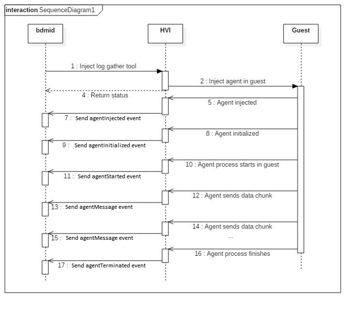
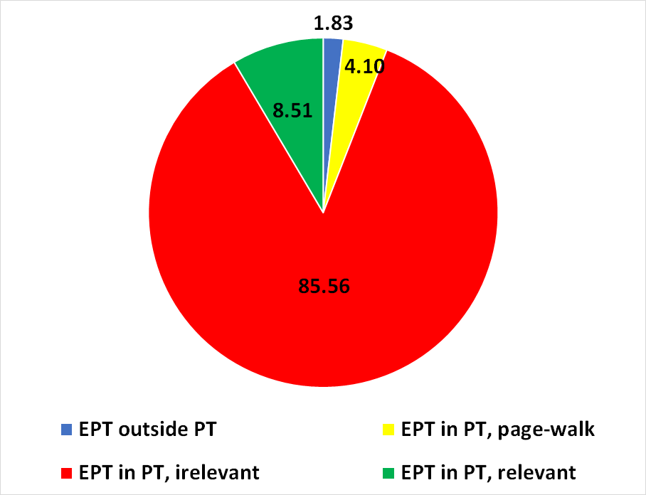

===================
Agents Architecture
===================

Agents can be injected inside the guest on demand. The API used to
inject agents is exposed inside the Glue interface, which comes in two
flavors: file injection or process injection.

Agent types
===========

There are two types of agents:

#. Special agents. These agents are built-in Introcore, and are injected
   when Introcore deems it necessary. The integrator has no control
   over their content, and they can be considered read-only. Changing a
   special agent requires the libintrocore binary to be rebuilt;
#. Normal agents. These agents are external, and can be injected inside
   the guest on demand. There are two types of normal agents:

   #. File agents. These are regular files, which are dropped by
      Introcore inside the guest, in a predefined location;
   #. Process agents. These are regular files which get injected inside
      the guest, and are then executed (hence they must be valid
      executables for the given OS type and version).

Injecting agents inside the guest
=================================

Injecting files
---------------

Injecting a file agent can be done using the :code:`InjectFileAgent` API. Check
out :code:`PFUNC_IntInjectFileAgent` in `glueiface.h`_ for more information about 
the parameters and usage of this function. The injected files will be located inside 
the **%SystemDir%** directory on Windows and inside the **/** directory on Linux. 
In addition, once the file is injected inside the guest, it will remain there.
The only way to delete an injected agent file is by injecting a process agent that deletes it.

Injecting processes
-------------------

Injecting a process agent can be done using the :code:`InjectProcessAgent` API. Check
out :code:`PFUNC_IntInjectProcessAgent` in `glueiface.h`_ for more information about 
the parameters and usage of this function. The injected executable will be located inside 
the **%SystemDir%** directory on Windows and inside the **/** directory on Linux. 
When injecting a process, a PID can be specified for the injection API. The process will be 
started from the provided process PID. If no PID is provided, by default, the **winlogon** 
process will be used on Windows, and the **init** process will be used on Linux.
This means that the injected process will run with maximum privilege level. 

Getting the content of an agent
-------------------------------

The contents of the agents to be injected (be it file or process) can be
directly specified when calling the injection API. However, the caller
can also use the :code:`GetAgentContent` API: this function will be called
by Introcore when injecting an agent for which a content hasn't been
specified. The integrator can identify the agent by using the provided
tag (which will be same for both the injection API and the :code:`GetAgentContent` call). 
Check out :code:`PFUNC_IntGetAgentContent` in `glueiface.h`_  for more information.

Agent tags
----------

Each agent type has a unique tag assigned. These tags can be used by the
integrator to uniquely identify agents. Some tags are reserved for
known/internal agents. Currently defined tags are:

+-----------------------------------------+---------+------------------------------------------------------------------------------------------+
| Tag name                                | Value   | Description                                                                              |
+=========================================+=========+==========================================================================================+
| INTRO_AGENT_TAG_DUMMY_TOOL              | 0       | A dummy tool used for testing purposes. It displays a message and exits.                 |
|                                         |         | This tool is built-in introcore, so a NULL :code:`AgentContent` can be specified for it. |
+-----------------------------------------+---------+------------------------------------------------------------------------------------------+
| INTRO_AGENT_TAG_REMEDIATION_TOOL        | 1       | The Windows remediation tool.                                                            |
+-----------------------------------------+---------+------------------------------------------------------------------------------------------+
| INTRO_AGENT_TAG_REMEDIATION_TOOL_LINUX  | 3       | The Linux remediation tool.                                                              |
+-----------------------------------------+---------+------------------------------------------------------------------------------------------+
| INTRO_AGENT_TAG_LOG_GATHER_TOOL         | 4       | A tool used to extract log files from within the guest.                                  |
|                                         |         | This tool is built-in introcore, so a NULL :code:`AgentContent` can be specified for it. |
+-----------------------------------------+---------+------------------------------------------------------------------------------------------+
| INTRO_AGENT_TAG_AGENT_KILLER_TOOL       | 5       | A tool used to kill agents inside the guest.                                             |
+-----------------------------------------+---------+------------------------------------------------------------------------------------------+
| INTRO_AGENT_TAG_CUSTOM_TOOL             | 100     | Any tag equal to or greater than this can be used to specify custom tools.               |
+-----------------------------------------+---------+------------------------------------------------------------------------------------------+

To define new agents, use tags above the :code:`INTRO_AGENT_TAG_CUSTOM_TOOL` value. 
The tags need not be known to Introcore - Introcore does not use the tags at anything; it
simply passes along the tag received by the injection API inside any event generated by the agent, 
so that the integrator can properly identify the agent.

Custom agents
-------------

The integrator can inject any file or process inside the guest. The
integrator has to ensure the use of a custom tag value (a value equal-to
or greater than :code:`INTRO_AGENT_TAG_CUSTOM_TOOL`). For example, the
integrator may wish to inject *test.exe* inside the guest with the
command line containing :code:`a b c`. To do so, the following call would be
used:

.. code-block: c

    InjectProcessAgent(GuestHandle, INTRO_AGENT_TAG_CUSTOM_TOOL, content of test.exe, size of test.exe, "test.exe", "a b c");

If the content of *test.exe* file is not specified (NULL is given), Introcore will call :code:`GetAgentContent` 
specifying the  :code:`INTRO_AGENT_TAG_CUSTOM_TOOL` tag. The integrator can then properly pass the *test.exe* 
content to Introcore.

Removing agents from the guest
==============================

Injected files will remain inside the guest until they are deleted by
someone. Injected processes will remain inside the guest until they
terminate. To forcefully terminate an injected process agent, the
integrator injects the killer agent inside the guest with the PID of the
agent to be killed specified in the command line.

Communicating with agents
=========================

Agent injection implies several events being sent by HVI to trace the
flow and the status of the injection. The EVENT_AGENT_EVENT_ structure.

EVENT_AGENT_EVENT_ Fields
-------------------------

- :code:`Event` - Identifies the event type. Can be one of the :code:`AGENT_EVENT_TYPE` enum values. 
- :code:`AgentTag`- The agent tag, as used when calling the :code:`InjectProcessAgent` API.
- :code:`ErrorCode` - An error code identifying the injection status. 
  An error code is defined for each agent event. Usually, however, it will be set for the 
  :code:`agentError` and for the :code:`agentTerminated` event, where it will represent the agent process 
  exit code. On Linux, this field will be an errno_ number, while on Windows it could represent 3 things:

  - A Windows `last error`_ code.
  - A NTSTATUS_ value, as returned by a kernel function.
    Distinguishing between these can be done by using the fact that an
    error NTSTATUS will always be smaller than **0** if signed, and
    greater than **0x80000000** when unsigned; therefore, a value less
    than **0x80000000** will be an error code, while a value greater than
    **0x8000000** will be an error NTSTATUS.
  - The process exit-status, if the event is :code:`agentTerminated`. 
    In this case, the ErrorCode represents a custom process exit code,
    and it's meaning depends on the tool itself.

- :code:`CurrentProcess` - the current process. It does not necessarily
  identify the agent process, especially before the agent proces is started.
- :code:`RemediationEvent` - 
  this structure is valid iff :code:`AgentTag == INTRO_AGENT_TAG_REMEDIATION_TOOL` 
  or :code:`AgentTag == INTRO_AGENT_TAG_REMEDIATION_TOOL_LINUX`.
- :code:`VisibilityEvent` - 
  this structure is valid iff :code:`AgentTag == INTRO_AGENT_TAG_VISIBILITY_TOOL`
- :code:`LogGatherEvent`- 
  this structure is valid iff :code:`AgentTag == INTRO_AGENT_TAG_LOG_GATHER_TOOL`

The following image illustrates the generic sequence of events that take place when injecting an agent process:

The following agent event types are currently defined:

- :code:`agentInjected` - event sent after the agent bootstrap has been
  injected. The file or process has not been injected yet, but the
  bootstrap agent responsible for that has. 
- :code:`agentInitialized` - event sent after the agent bootstrap has
  initialized everything that's needed for the agent. This event is
  sent after the agent file or process is dropped, but the process
  agent may still not be created when this event is sent.
- :code:`agentStarted` - event sent after the agent process has started.
- :code:`agentTerminated` - event sent after the agent process has terminated.
- :code:`agentMessage` - 0 or more such events may be sent by the agent
  process and they represent custom data sent by the agent.
  The **union** inside the event structure identifies this custom
  data, depending on the agent tag. This is the only agent event that
  is not generic and it applies to individual agent processes.
- :code:`agentError` - such an event will be sent for errors that took
  place while injecting the agent. Please note that this error code
  applies to the **injection** process and not to errors that may
  appear inside the process agents. Each agent has the responsibility
  of defining its own communication structure, where it can include
  whatever error messages it needs. If no such event is sent, one can
  assume the entire injection finished without errors.

Specific agents structures
--------------------------

Depending on the type (tag) of the agent, the :code:`agentMessage` event
type will carry agent specific payloads. Each agent has the responsibility 
of defining its own specific structures to be send to the integrator. 
Each type of specific agent message has its own hypercall code:

+-------------------------------+--------------+-----------------------------------------------+---------------------+
| Name                          | Value        | Description                                   | Structure           |
+===============================+==============+===============================================+=====================+
| AGENT_HCALL_REM_TOOL          | 100          | Hypercall code used by the remediation tool   | AGENT_REM_EVENT_    |
+-------------------------------+--------------+-----------------------------------------------+---------------------+
| AGENT_HCALL_GATHER_TOOL       | 500          | Hypercall code used by the log gather tool    | AGENT_LGT_EVENT_    |
+-------------------------------+--------------+-----------------------------------------------+---------------------+
| AGENT_HCALL_INTERNAL          | 753200       | Hypercall code reserved for internal use      | Reserved.           |
+-------------------------------+--------------+-----------------------------------------------+---------------------+

Agents injected in guest can report information to HVI using these
hypercall codes. If a new agent needs to report a new type of data, new
hypercall codes and new structures must be added. The hypercall
interface between the agents and HVI is the following:

+----------------+----------------+--------------------------------------------------------------------------------------------------------------+
| x86 register   | x64 register   | Value                                                                                                        |
+================+================+==============================================================================================================+
| EAX            | RAX            | 34                                                                                                           |
+----------------+----------------+--------------------------------------------------------------------------------------------------------------+
| EBX            | RDI            | 24                                                                                                           |
+----------------+----------------+--------------------------------------------------------------------------------------------------------------+
| ECX            | RSI            | 0                                                                                                            |
+----------------+----------------+--------------------------------------------------------------------------------------------------------------+
| EDX            | RDX            | Hypercall code, as previously defined.                                                                       |
+----------------+----------------+--------------------------------------------------------------------------------------------------------------+
| ESI            | RBX            | Pointer to a structure of the type defined for this hypercall.                                               |
|                |                | Before issuing the hypercall, this memory region must be locked in memory, to ensure it isn't swapped out.   |
+----------------+----------------+--------------------------------------------------------------------------------------------------------------+

For example, if a remediation event is sent on a 64 bit guest, the remediation tool would issue a hypercall having 
:code:`RAX = 34, RDI = 24, RSI = 0, RDX = AGENT_HCALL_REM_TOOL (100), RBX = pointer` to a AGENT_REM_EVENT_ structure. 
Once this hypercall is received by HVI, several security and integrity checks will be performed. If everything is OK, 
HVI will send an agent event, having the event type set to :code:`agentMessage` and the tag set to 
:code:`INTRO_AGENT_TAG_REMEDIATION_TOOL`. In this case, the :code:`RemediationEvent` inside the EVENT_AGENT_EVENT_ will be
interpreted, and it will contain the data sent by the agent to HVI.

Special Agents
==============

#VE filtering
-------------

Motivation
~~~~~~~~~~

The EPT works with **GPA** - Guest Physical Addresses. However, a guest
normally operates with **GLA** - Guest Linear Addresses. which get
translated to a **GPA** by using the in-guest page-tables. If Introcore 
needs to protect a **GLA** page inside the guest, it first has
to translate it to a **GPA** and apply the EPT restriction on that
resulting **GPA**. This creates a problem: if the translation for
that **GLA** changes, Introcore would still protect the old **GPA**,
leading to multiple problems:

#. We lose protection on the new physical page;
#. We end-up protecting the old page, which may be reallocated for other purposes.

To overcome this *remapping issue*, Introcore monitors all the
page-table entries which translate the protected **GLA**. Therefore,
when the translation is modified at any page-table level, Introcore
would be notified, because those modifications made to the page-tables
would generate an EPT violation.

This creates a problem: there are many writes inside the page-tables,
many of which are of no use to us; these writes have two sources:

#. The OS memory-manager, doing mm stuff (mapping, unmapping, changing protection, etc.);
#. The CPU page-walker, when setting the A/D bits.

Most of the modifications are not useful to us; we care about only those
modifications which modify the mapping bits (51:12) or a control bit
(XD, R/W, U/S, PS, P). All other modifications (made to ignored bits,
A/D bits by either the mm or page-walker) are irrelevant. Therefore, we
created the #VE filtering mechanism, which allows us to quickly filter,
directly inside the guest, those page-table modifications which are not
useful to us. Those which are will be notified to Introcore by using a
VMCALL. The following figure illustrates the small percentage of
relevant page-table modifications.

The role of the #VE agent is to filter out page-table accesses by using
the **virtualization exception (#VE)** instead of EPT violations. 
To do so, we inject a small driver agent which intercepts the 
:code:`nt!KiVirtualizationException` handler and filters all page-table
accesses via the #VE event (we mark all page-table pages as
**convertible** inside the EPT, which means that a #VE can be triggered
instead of EPT violation).

Important terms:

- **#VE** - virtualization exception; a new type of exception (vector
  number 20) delivered by the CPU instead of a traditional EPT
  violations for EPT pages which are convertible
- **#VE agent** - the agent driver which is injected inside the guest
  to handle virtualization exceptions
- **Convertible page** - a page which is marked as **convertible**
  inside the EPT (has EPT entry bit 63 cleared); #VE can be generated
  only for convertible pages
- **VMFUNC** - a new instruction which executes VM functions; the only
  VM function currently defined is the VMFUNC 0, which allow the caller
  to switch the EPT to another one
- **Default EPT** - the EPT in which the guest normally executes code;
  this is where all protections are set
- **Protected EPT** - the EPT in which the #VE agent executes;
  read-write, except for the #VE agent, which is also executable

Injection and removal of the #VE agent
~~~~~~~~~~~~~~~~~~~~~~~~~~~~~~~~~~~~~~

#VE init
^^^^^^^^

#. Detect #VE support; this is done by:

   - Querying #VE support (:code:`IG_QUERY_INFO_CLASS_VE_SUPPORT`)
   - Querying VMFUNC support (:code:`IG_QUERY_INFO_CLASS_VMFUNC_SUPPORT`)
   - Check that all #VE related APIs are initialized in the `glue interface`_:

     - :code:`SetVeInfoPage`
     - :code:`CreateEPT`
     - :code:`DestroyEPT`
     - :code:`SwitchEPT`
     - :code:`GetEPTPageConvertible`
     - :code:`SetEPTPageConvertible`

   - Check if the VM has maximum 64 VCPUs, which is the currently maximum number supported

#. Create a new EPT, which will be used by the #VE agent (this is done here to avoid creating it each 
   time we inject the #VE agent; it is done only once per Introcore session)
#. Mark that entire EPT as being non-executable

Agent injection
^^^^^^^^^^^^^^^

#. Injection is done if the following conditions are met:

   - #VE subsystem is initialized (check Phase 0)
   - The :code:`OPT_ENABLE_VE` :ref:`optimization option <chapters/2-activation-and-protection-options:optimizations using in-guest agents>` 
     is set in global options
   - The guest has finished booting

#. Injection stage 1: we don't need to do anything
#. Injection stage 2:

   - Pause all the VCPUs; this is important, as we are sure that the
     agent will not be tampered with during the injection
   - Pre-load & load the #VE agent image according to the base address
     of the memory which was allocated inside the guest
   - Write the agent inside the guest memory space
   - Patch the protected EPT index inside the agent (for the **VMFUNC**
     instruction); this has to be done because we don't know which will
     be the protected EPT (for example, it will usually be 1 on Napoca,
     2 on Xen)
   - Patch the untrusted EPT index inside the agent (for the
     **VMFUNC** which switches back to the original EPT); this has to
     be done because some CPUs have an errata where a #VE will always
     deliver the value **0** for the EPT index where the #VE took place
   - Patch the self-map index inside the agent; this is used for fast
     page-walk emulation
   - Patch the monitored PT bits inside the agent (relevant bits); this
     allows flexibility in that we can dynamically update which bit
     modifications we wish to be reported to Introcore
   - Patch the jump-back address inside the agent (used to transition
     back to the guest OS); we must exit from the kernel using
     the :code:`KiKernelExit` function, which does all the necessary
     transitions 
   - Hook the :code:`KiVirtualizationExceptionHandler` inside the guest -
     note that we hook the function AFTER the KPTI switch;
     the :code:`KiVirtualizationExceptionHandler` will point to one of
     the following #VE handlers:

     - :code:`VeCoreVirtualizationExceptionHandlerKPTI` - used on old OSes
       (Windows 7, 8, 8.1, 10 TH1, TH2, RS1 and RS2), which are not
       aware of the #VE exception, and for which #VE is an unexpected ISR
     - :code:`VeCoreVirtualizationExceptionHandlerNoKPTI` - used on old
       OSes (Windows 7, 8, 8.1, 10 TH1, TH2, RS1 and RS2), which are
       not aware of the #VE exception, and for which #VE is an unexpected interrupt
     - :code:`VeCoreVirtualizationExceptionHandler` - on Windows 10 RS3
       and newer, which are aware of the #VE and treat it just like any other exception, with or without KPTI.

   - Patch the code that we replaced inside :code:`KiVirtualizationExceptionHandler` in a dedicated area
     of the #VE agent; we use this code to execute it if we have to jump back to the original #VE handler, 
     in the case of older Windows versions which do not support #VE
   - Set up the CPU map - which VCPU maps to which #VE info page inside the guest
   - Hook the agent inside the default EPT view - the entire agent is marked as not-present (not readable, 
     not writable, not executable); only the **VESTUB** section, which contains the **VMFUNC** trampoline, 
     is marked executable in the default EPT view
   - Mark the agent as executable (code pages only) inside the protected EPT view; all other sections will be read-write
   - Hook the page-tables for each #VE agent page - this allows us to remap agent pages if the OS thinks this is required; 
     note that the agent is non-paged, so normally, its pages won't be swapped out
   - Initialize the #VE information pages; this also enabled #VE on each CPU

#. Injection stage 3:

   - Mark all the page-table pages as being convertible - from now on, we can accept #VE
   - Reset the Reserved field to 0 inside the #VE info page - signals the CPU it is free to generate #VE instead of EPT

Note that **there is no need for in-guest initialization**! All the init
is done by Introcore, while the VM is paused, so the attack surface is minimal during the initialization.

Agent removal
^^^^^^^^^^^^^

#. Removal stage 1:

   - Remove the convertible flag from EPT for all page-table pages

#. Removal stage 2:

   -  Make sure there are no RIPs pointing inside the #VE agent - this
      is done using the in-guest loader driver, which will periodically
      issue a check hypercall, to see if it can call the #VE uninit
      functions
   - Remove the KiVirtualizationException hook
   - Remove the #VE agent driver protection from the default EPT
   - Mark the #VE agent as no executable again inside the protected EPT

Just like the init phase, **there is no need for in-guest uninitialization**! Everything is done in Introcore.

#VE uninit
^^^^^^^^^^

We simply destroy the EPT created during the init phase. Nothing else needs to be done here.

#VE agent functionality
~~~~~~~~~~~~~~~~~~~~~~~

The #VE agent filters 2 types of events:

- Page-walks - these are the A/D events which are handled by emulating
  the page walk. There is a simpler approach of touching the page which
  was originally accessed, but this may trigger #PF, and to handle
  them, we'd need to intercept the #PF handler, which would make the
  entire #VE transition slower;
- Page-table entries modifications - these are the classic writes; the
  #VE will decode and emulate the instruction, and issue a hypercall to
  HVI if the modification is relevant. Note that the #VE agent uses a
  page-table locking scheme: to avoid race conditions between multiple
  VCPUs, we will place a lock for the entry offset located in the
  top-most page-table entry which is not self map; this means,
  essentially, that we will lock an entire translation hierarchy
  starting with a PML4 entry to avoid issues where two VCPUs operate on
  translations belonging to the same VA. There are 512 locks, one for
  each possible PT entry. A lock is used for the same entry offset no
  matter what page-table level they are in, and even if they are in
  different page-tables.

The #VE agent main components are:

- The main handler - ensures proper transition in and out of the
  protected EPT view and saves and restores the registers state;
- The page-walk emulator - simply emulates the page-walk issued by the
  CPU, setting the A/D bits in the process. The page-walk is emulated
  in the context of the current CR3, which, on KPTI-enabled Windows,
  will be the kernel CR3; therefore, in some cases, an infinite loop
  will be generated inside the guest, because the PML4 entry inside the
  user CR3 may not be accessed; whenever we detected such a case, we
  notify Introcore to complete the page-walk using the user CR3;
- The instruction emulator:

  - Decodes the accessed address (to compare it to the one actually
    accessed by the CPU - sanity check),
  - Fetches the old PTE value
  - Emulates the instruction (common cases are supported - MOV, STOS,
    XCHG, CMPXCHG, AND, OR, XOR, BTS, BTR, BTC); note that the new
    value is **not written back** to memory yet
  - Fetches the new PTE value
  - Checks if the old and new modified in a relevant way, and if so,
    issues a VMCALL to notify the HVI engine
  - Write back the new PTE values, flags & RIP

HVI handles the modification VMCALL by constructing a synthetic state
(registers and instruction) and calling the native memory modification
handler, which will in turn call each PT write callback. 

Introcore can also handle remap operations on the #VE pages - it makes
sure the correct contents of the remapped page is present inside the new
physical page, by making a copy. This has to be done, as the copy made
by the OS may be outdated - if, for example, the OS tries to remap the
stack of the #VE agent, the remap operation would trigger a #VE (since
it writes a PTE); this will automatically make the copy invalid, as the
stack has just been modified by the #VE delivery. To avoid this, the
page is copied by Introcore.

#VE architecture
~~~~~~~~~~~~~~~~

The #VE agent requires two EPTs:

#. The original EPT view, in which the guest normally works, and where all the protections are set
#. The protected EPT view, in which the agent runs

Different components are mapped differently in the 2 EPT views, as one
can see in the following table:

+------------------------------+----------------+-----------------+
| Component                    | Original EPT   | Protected EPT   |
+==============================+================+=================+
| Kernel and user components   | RWX :sup:`*`   | RW-             |
+------------------------------+----------------+-----------------+
| #VE agent                    | ---            | RWX :sup:`**`   |
+------------------------------+----------------+-----------------+
| #VE information pages        | R--            | RW-             |
+------------------------------+----------------+-----------------+
| VMFUNC page                  | --X            | --X             |
+------------------------------+----------------+-----------------+

:sup:`*` Other restrictions may apply, depending on HVI policy (there may be
protected pages which are not, in fact, writable, for example).

:sup:`**` Read-only and code sections will not be writable, data sections
will not be executable.

New protections required by the #VE mechanism
~~~~~~~~~~~~~~~~~~~~~~~~~~~~~~~~~~~~~~~~~~~~~

To properly protect all the structures & components of the #VE system,
the following protections exist:

- The #VE agent is marked as non-accessible inside the default EPT
  view; any attempt to read, modify or execute it will generate an
  alert;
- The #VE agent is the only executable entity inside the protected EPT
  view; any attempt to execute something other than the agent will
  generate an alert;
- The IDT is hooked directly via EPT on Windows versions which marked
  it as read-only; unfortunately, only integrity protection will be
  used on older Windows version;
- The IDTR and GDTR are protected from being modified;
- The page-tables which translate the #VE agent are all monitored, and
  any translation will make us update the protection on the #VE agent
  pages.

CPU side-channel mitigations
~~~~~~~~~~~~~~~~~~~~~~~~~~~~

The #VE agent is protected against Spectre, Meltdown & MDS attacks:

- It used the guest kernel CR3 switch functionality in order to run in
  a different VA space
- It uses the VMFUNC instruction to run inside a separate PA space
- It uses IBRS & IBPB to mitigate Spectre attacks
- It uses RSB stuffing technique to mitigate RSB-based Spectre attacks
- The MDS buffers are flushed before returning inside the non-protected
  EPT view

Security Analysis
~~~~~~~~~~~~~~~~~

There are several security-related aspects when dealing with the #VE
agent:

#. Agent injection. As mentioned, the agent initialization is being done
   entirely by HVI while the guest is paused, so the chance of an
   attacker interfering with us are zero. As soon as the agent
   initialization is done, the protected EPT is already initialized, and
   the agent will be protected inside the original EPT view;
#. Agent protection inside the original EPT view. As mentioned before,
   the #VE agent is not accessible inside the original EPT view, so an
   attacker cannot read, write or execute memory belonging to the agent;
#. Agent protection inside the protected EPT view. As mentioned before,
   read-only sections of the agent are marked non-writable, and data
   sections are marked non-executable. In addition, all the guest memory
   is marked non-executable inside the protected EPT view, so an
   attacker cannot gain code execution easily, even if a vulnerability
   is present;
#. Stacks. The untrusted guest stack is used only to save the RAX, RCX,
   RDX & RBX registers before switching the EPT using VMFUNC.
   Afterwards, a trusted, protected stack is loaded. Should an attacker
   mangle the untrusted stack (for example, force us into generating a
   fault), this would lead to a machine hang, since the exception
   handlers are not executable inside the protected view;
#. Switching into other EPT views. The hypervisor must make sure that
   only two EPT views can be switched into: the protected EPT view and
   the original EPT view. Leaving other EPT views inside the EPTP page
   may allow the guest to unexpectedly switch into them.

In-guest PT Filtering
---------------------

Normally, introcore maintains EPT hooks on the guest page tables to
catch relevant PTE changes (translation changes, swap-ins and swap-outs,
page size modifications, etc). In special cases, this is not feasible
due to the imposed performance penalty. Currently, this happens on newer
x64 Windows 10 versions (starting with RS4, build 17134). 

This is done by using a "fake #VE" mechanism. Note that this mechanism
is for debugging mostly, and performance analysis - please avoid using
it in real-life scenarios, as it only handled PT writes issued by the
NT. In reality, if an attacker makes PT changes by itself, it will most
likely cause an OS crash.

Initialization
~~~~~~~~~~~~~~

- Scan the :code:`.text` section inside the kernel and replace any
  instruction that may modify a PTE with an :code:`INT3`. An instruction is
  a candidate instruction if:

  - It is either :code:`MOV`, :code:`XCHG`, :code:`CMPXCHG`;
  - Destination operand is memory without index or displacement, or if
    displacement is present, it is less than 0x20 and it is QWORD aligned;
  - Destination operand base register is not RSP;
  - Source operand is a register or the immediate value 0;
  - The write size is 8 bytes;

- A fake #VE driver is injected inside the guest. It hooks the #VE
  handler. This is done after **services.exe** is started if introcore has
  the :code:`INTRO_OPT_IN_GUEST_PT_FILTER` 
  :ref:`optimization option <chapters/2-activation-and-protection-options:optimizations using in-guest agents>` 
  (or when the option is received);
- All GPA hooks that were set on page tables are removed;
- When an :code:`INT3` is hit, the write operation is checked to see if it actually writes a PTE:

  - If not, the original instruction is restored;
  - If it modifies a PTE, the :code:`INT3` is replaced with an :code:`INT 20`;

- When an :code:`INT 20` is dispatched, the original instruction is executed in guest, 
  the GLA, GPA, old value and new value are saved and a VMCALL is issued;
- Introcore handles the memory access as usually. 

Uninit
~~~~~~

- An unloader driver is injected
- On the injection callback, the :code:`INT 20` hooks are removed, the
  candidate instructions are restored and the GPA hooks are set again
  on the guest page tables. 

Syncronization
~~~~~~~~~~~~~~

To have a fixed ordering between the instructions that modify e PTE and
Introcore, a spinlock is used inside the guest. The reasoning behind
this is that the instruction that modifies the PTE is executed **before** 
issuing a hypercall to HVI; therefore, two CPUs may race against each other, 
leading to a condition where one of those CPUs issues the hypercall before 
the CPU that already emulated the PTE write, causing a serialization issue 
(an older PTE write is handled by Introcore after a newer one). 

In addition to this spinlock, the interrupts are disabled while doing
this handling; using a spinlock with interrupts on would easily lead to deadlocks.

Other info
~~~~~~~~~~

There are some instructions that modify page tables in paged sections,
but it seems that there is no need to hook them:

- :code:`MiAllocateTopLevelPage` - called at process creation before
  :code:`PspInsertProcess`, so before Introcore is aware of that process;
- :code:`MiAddMappedPtes` - always called on swap pages;
- :code:`MiRelocateImagePfn` - temporary mappings for user mode VAs in kernel
  space in order to fix some relocations;
- :code:`MiValidateImagePfn` - same as MiRelocateImagePfn;
- :code:`MmAllocateMappingAddress` - same as MiAddMappedPtes, but is seems that it is rarely called.

Instructions that are not located inside the nt and which modify PTEs
**are not** monitored, but they can be. The PT filter is not intended to
be used as production code, and it is intended just as a hackish
performance optimization for page-table modifications.

Agent Killer
------------

The agent killer has the tag 5 (:code:`INTRO_AGENT_TAG_AGENT_KILLER_TOOL`). 
This agent can be injected to terminate another process agent (or any other process). 
The tool receives a list of "name, pid" pairs, where name indicates the image
name and pid indicates the PID to be killed. Usage example:

.. code-block:: c

    InjectProcessAgent(GuestHandle, INTRO_AGENT_TAG_AGENT_KILLER_TOOL, NULL, 0, "killer.exe", "proc1.exe 10 proc2.exe 20 proc3.exe 30");

The killer agent does not send events to HVI.

Log gather
----------

The log gather agent has the tag 4 (:code:`INTRO\_AGENT\_TAG\_LOG\_GATHER\_TOOL`). 
This agent can be used to collect logs from the guest VM. When injecting such a tool,
the :code:`Args` parameter of the :code:`InjectProcessAgent` API must contains
the path of one or more files to be retrieved. Wild-cards can be used in
this path, in which case more than one file could be retrieved. Example
of injection:

.. code-block:: c

    InjectProcessAgent(GuestHandle, INTRO_AGENT_TAG_LOG_GATHER_TOOL, NULL, 0, "gather.exe", "%TEMP%\\*.log");

The log gather agent will search for all the matching files inside the
provided path and it will send the log data to the integrator using
the AGENT_LGT_EVENT_ structure.

Since the logs extracted from the guest may be large, the log gather
agent will send small chunks of it to the HVI, which will then be sent
to the integrator. The chunk limit is now 1KB (defined by
:code:`LGT_MAX_DATA_SIZE` - the entire structure cannot exceed 4K in
size), but it may be increased in the future. There are two log gather
events currently defined by the :code:`EventType` field inside
the :code:`Header` substructure:

- :code:`lgtEventError` - interpret the :code:`ErrorEvent` structure; used to report the error status of the tool. 

  - On Windows, this field will contain the actual Windows `last error`_ code
  - On Linux, this field will contain the actual errno_ code

- :code:`lgtEventData` - interpret the :code:`DataEvent` structure; used to send the next data chunk:

  - :code:`FileName` - the name of the log file from which the current chunk was extracted
  - :code:`DataSize` - how much bytes are valid inside the :code:`Data` structure
  - :code:`Data` - an array of actual bytes extracted from the log.

For each detected log file, the log gather agent will send each chunk,
one by one, to the integrator. The log file can then be reconstructed.
For example, if :code:`%TEMP%\test.log` is 2.5KB in size, then 3
:code:`eventAgentEvent` events will be sent, each such event will have the
type :code:`agentMessage`, and inside the :code:`LogGatherEvent`, the
:code:`Header.EventType` field will be :code:`lgtEventData`. For each of
these events, the :code:`FileName` will be :code:`%TEMP%\test.log`, and
the :code:`Data` field will contain the actual log data.

Remediation Tool
----------------

These are sent by remediation tools (tag :code:`INTRO_AGENT_TAG_REMEDIATION_TOOL`
or :code:`INTRO_AGENT_TAG_REMEDIATION_TOOL_LINUX`). The remediation tool must be 
injected by the integrator (HVI does not inject this by itself).

Depending on :code:`AGENT_REM_EVENT.AGENT_REM_EVENT_HEADER.EventType`,
the substructures must be interpreted accordingly and identify various
remediation events:

- :code:`EventType == remEventStart` → :code:`StartEvent`
- :code:`EventType == remEventDetection` → :code:`DetectionEvent`
- :code:`EventType == remEventDisinfection` → :code:`DisinfectionEvent`
- :code:`EventType == remEventProgress` → :code:`ProgressEvent`
- :code:`EventType == remEventReboot` → :code:`RebootEvent`
- :code:`EventType == remEventFinish` → :code:`FinishEvent`

The :code:`Version` field of the :code:`Header` substructure must be equal
to :code`REM_EVENT_VERSION`, and the :code:`Size` field must be equal
to :code`REM_EVENT_SIZE`. 
Usually, the sequence of events for the remediation process will be: 
:code:`remEventStart` → [ :code:`remEventDetection`\| :code:`remEventDisinfection`\| :code:`remEventProgress` ] → [ :code:`remEventReboot` ] → :code:`remEventFinish`.

Notes
=====

- The injected files will always be located inside :code:`%SystemDir%` on
  Windows, and :code:`/` on Linux, since the initial bootstrap agent runs inside
  the context of the SYSTEM/root user.

- The injected processes will usually run under the SYSTEM/root user, so
  care must be taken to avoid vulnerabilities that may allow for privilege
  escalation. The caller can select another process as a parent, in which
  case the process will inherit the same user.

- The injection process is asynchronous - the file or process may have
  not been injected when the injection functions return.

- In the case of injected files, the file will never be deleted by HVI
  or any built-in agent component.

- In the case of processes, the executable file will be deleted by the
  HVI built-in bootstrap agent after the process finishes execution.

- Messages sent by the injected agents after an Introcore reload may be
  ignored, if the agent tag is not known.

- The injection mechanism does not check in any way if a file with the
  same name as the agent file/process already exists! Make sure you do not
  use names that may already exist in the %system% folder, otherwise they
  will be overwritten!

.. _glueiface.h: ../_static/doxygen/html/glueiface_8h.html
.. _EVENT_AGENT_EVENT: ../_static/doxygen/html/struct___e_v_e_n_t___a_g_e_n_t___e_v_e_n_t.html
.. _errno: http://man7.org/linux/man-pages/man3/errno.3.html
.. _last error: https://msdn.microsoft.com/en-us/library/windows/desktop/ms681382(v=vs.85).aspx
.. _NTSTATUS: https://msdn.microsoft.com/en-us/library/cc704588.aspx
.. _AGENT_REM_EVENT: ../_static/doxygen/html/struct___a_g_e_n_t___r_e_m___e_v_e_n_t.html
.. _AGENT_LGT_EVENT: ../_static/doxygen/html/struct___a_g_e_n_t___l_g_t___e_v_e_n_t.html
.. _glue interface: ../_static/doxygen/html/struct___g_l_u_e___i_f_a_c_e.html
