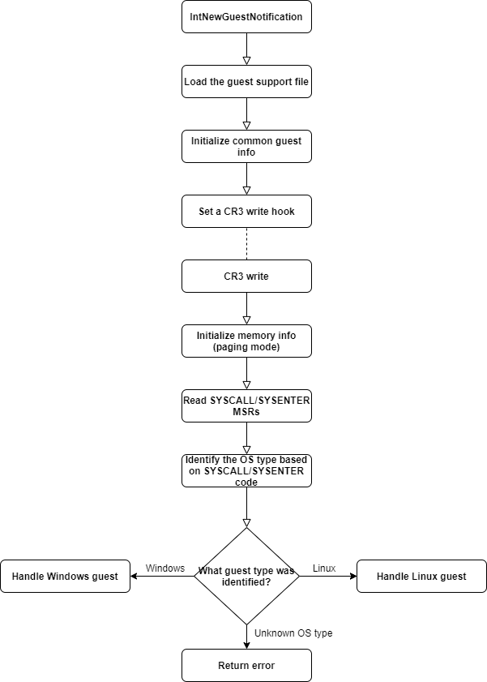

=====================
Development guideline
=====================

Developing New Protection Features Guideline
============================================

- Design the new protection feature:

  - Usually a small design document, justifying the need for the feature, is required;
  - Make sure the feature is feasible - dwelling too deep into
    undocumented OS structures or intercepting very commonly accessed
    structures may make the feature unworthy of the performance impact
    or maintenance complexity;

- Implement the new protection feature in Introcore:

  - Add new hooks and handlers, if required; Usually, the protection feature will require:

    - **activation** logic (enabling the feature - finding structures in memory, placing memory hooks, etc.);
    - **deactivation** logic (disabling the feature - removing any hook set on protected structures);
    - **handling** logic (actually handling the events that are used to identify potential attacks - EPT violations, etc.);

  - Add new global/per process protection flags, if required: one must
    be able to enable/disable the new protection feature via dedicated
    new flags inside the global Introspection options or the
    per-process flags;
  - Add new alert type or extend existing alert types, if required;
    protection features will either use existing violation structures,
    or define new ones;

- Implement test tools for the new protection feature:

  - Test as many attack scenarios as possible;
  - Don't be cheap on scenarios! For example, when testing a memory
    write, make sure you have as many scenarios as possible: page
    boundary writes, writes using various sizes (1, 2, 4, 8 bytes),
    writes using different instructions (MOV, ADD, XOR, MOVNTDQ,
    etc.), writes using implicit memory accesses (for example, by
    stack pushes issued by CALL instructions), etc.

- Implement performance testing for the new feature:

  - If a new hook is placed, this will inevitably cause performance
    impact; asses this impact! 
  - If possible, implement a micro-benchmark for the feature. For
    example, if the new feature involves intercepting execution of a
    certain API, asses by calling the involved API and observing how
    much of an impact Introcore brings!

- Asses the viability of the new protection feature:

  - Performance, in real-life scenarios:

    - Is the performance impact obvious?
    - Is any workload impacted?
    - Is the overall behavior of the VM affected?

  - False-positives:

    - Does the new feature trigger false-positives?
    - Are they triggered by natural OS behavior?
    - Are they triggered by shady software?

  - Actual Protection:

    - Are there actual attacks that could be prevented using this feature?
    - Is it feasible to employ such an attack?

- Document the new feature

  - Overall functionality and the use-cases (the design document,
    which will be part of this documentation, Development Guidelines chapter);
  - The new hooks/handlers, if any (source code must be documented
    using Doxygen);
  - The new flags;
  - The new alerts;

New feature design document template
====================================

When designing a new feature, the following template can be used to
answer the most important questions regarding that feature. Any
pull-request for a new feature must include answers for **all** of
these questions.

+------------------------------------------------+-------------------------------------------------------------------------------------------------------------------------------------------------------------------------------------------------------------------------------------------------------------------------------------------------------------------------+
| Question                                       | Answer                                                                                                                                                                                                                                                                                                                  |
+================================================+=========================================================================================================================================================================================================================================================================================================================+
| What will the new feature protect?             | Detail the structure(s) that will be protected by this feature.                                                                                                                                                                                                                                                         |
|                                                |                                                                                                                                                                                                                                                                                                                         |
|                                                | Example: *The feature will protect the kernel exports directory (EAT) against reads*.                                                                                                                                                                                                                                   |
+------------------------------------------------+-------------------------------------------------------------------------------------------------------------------------------------------------------------------------------------------------------------------------------------------------------------------------------------------------------------------------+
| How will the protection be made?               | Describe how the feature will achieve protection, technically.                                                                                                                                                                                                                                                          |
|                                                |                                                                                                                                                                                                                                                                                                                         |
|                                                | Example: *The feature will place an EPT read hook on the kernel exports directory*.                                                                                                                                                                                                                                     |
+------------------------------------------------+-------------------------------------------------------------------------------------------------------------------------------------------------------------------------------------------------------------------------------------------------------------------------------------------------------------------------+
| Why is the feature required?                   | Motivate the decision of implementing the new feature, by explaining it's value.                                                                                                                                                                                                                                        |
|                                                |                                                                                                                                                                                                                                                                                                                         |
|                                                | Example: *When exploiting a kernel vulnerability, the shellcode that gets code execution will need to locate the address of various kernel functions to work properly. This is usually achieved by directly reading and parsing the exports section of the kernel image*.                                               |
+------------------------------------------------+-------------------------------------------------------------------------------------------------------------------------------------------------------------------------------------------------------------------------------------------------------------------------------------------------------------------------+
| Are there any real attacks leveraging this?    | List the attacks that are known to use this technique. Don't be cheap - the more attacks there are, the faster the feature will be merged!                                                                                                                                                                              |
|                                                |                                                                                                                                                                                                                                                                                                                         |
|                                                | Example: *Attacks such as EternalBlue or BlueKeep contain shellcode that once they have gained execution, will try to locate the address of important kernel functions by using the described method*.                                                                                                                  |
+------------------------------------------------+-------------------------------------------------------------------------------------------------------------------------------------------------------------------------------------------------------------------------------------------------------------------------------------------------------------------------+
| How likely is for false-positives to appear?   | Justify, with concrete examples, the likelihood of false-positives. List any software that you know triggers this behavior and must be whitelisted.                                                                                                                                                                     |
|                                                |                                                                                                                                                                                                                                                                                                                         |
|                                                | Example: *Regular legitimate kernel code will locate needed functions via the implicit loader during image load, or via known API such as MmGetSystemRoutineAddress. It is unlikely that benign components will trigger this behavior, but security drivers (AV, DLP, etc.) might trigger this*.                        |
+------------------------------------------------+-------------------------------------------------------------------------------------------------------------------------------------------------------------------------------------------------------------------------------------------------------------------------------------------------------------------------+
| What is the projected performance impact?      | Justify the performance impact with numbers.                                                                                                                                                                                                                                                                            |
|                                                |                                                                                                                                                                                                                                                                                                                         |
|                                                | Example: *The kernel EAT is read on each driver load. On a system with 150 loaded drivers, 150000 EPT read violations were triggered due to the normal kernel loader operations. Additional read accesses inside the NT EAT are generated only when drivers are loaded - on average, 1000 reads per loaded driver*.     |
+------------------------------------------------+-------------------------------------------------------------------------------------------------------------------------------------------------------------------------------------------------------------------------------------------------------------------------------------------------------------------------+

Important terms
===============

To better understand the following sections (and several terms used
throughout the source code), several important terms must be clarified
and defined.

- **Guest Virtual Address** - a guest virtual address is a regular
  virtual address used by applications (or the kernel inside the
  guest). The term is used interchangeably throughout this
  documentation and the Introcore source-code with guest linear address
  (normally, the guest linear address is obtained once segmentation is
  applied to the guest virtual address). You will most often see these
  abbreviated: **GVA - Guest Virtual Address, GLA - Guest Linear Address**.
- **Guest Physical Address** - a guest physical address is obtained by
  translating a **GLA** using the in-guest page-tables. Guest
  physical address or **GPA** for short are then translated using the
  Extended Page Table to a host physical address.
- **Host Physical Address** - the actual physical address that gets
  accessed, once the **GPA** is translated using the **EPT**.
- **Extended Page Table** - the extended page table, or **EPT**, is
  the second-level address translation mechanism implemented by Intel
  CPUs. It is configured and controlled by the hypervisor, and it is
  also used by Introcore to enforce access restrictions to certain
  **GPA** pages inside the guest.
- **The translation mechanism** - the usual translation mechanisms look
  like this: **GVA/GLA** → **(Guest page-table)** → **GPA** → **(EPT)** →
  **HPA**.
- **Page Table** - this term is used to refer to physical pages that
  are used by the CPU to translate **GLA** to **GPA**. Usually, when
  used independently, the term refers to any level of the translation
  (**PML5**, **PML4**, **PDP**, **PDP**, **PT**), but when used in
  explicit sentences involving other layers of translation as well,
  Page Table or **PT** for short will refer to the last level of translation.
- **Frame Number** - hypervisors (especially Xen) will usually work
  with **frame numbers**. Usually, this term refers to the **guest physical page number**,
  which is basically the **GPA** shifted 12 positions to the right.
- **#PF**, **#UD**, **#VE**, etc.- throughout the Introcore source code and
  this documentation, x86 exceptions will usually be referred to using
  the Intel abbreviation, as defined in the Intel SDM.
- **WORD**, **DWORD**, **QWORD**, etc. - Introcore and this documentation use
  the Intel definition of these data types: **WORD** = 2 bytes, **DWORD** = 4
  bytes, **QWORD = 8 bytes**.
- **Hook vs. Detour** - generally, Introcore defines a **hook** as
  being a memory hook placed using the EPT - for example, "*page X is
  write-hooked*" means that the GPA page X translates to is marked
  non-writable inside the EPT. When referring to regular API hooks, the
  term **detour** is used, and it represents regular API hooks, but
  which will usually trigger a VM-exit.

Overall internal architecture
=============================

The overall internal Introcore architecture is built around
the :code:`gGuest` structure. The :code:`gGuest` describes a guest VM, and
it contains most of its state and information. In addition to the 
:code:`gGuest`, there is also the :code:`gVcpu`. This will always point
to the current VCPU, which generated the event that is currently being
handled. When an EPT violation takes place, Introcore will make
:code:`gVcpu` point to the actual VCPU that triggered the event.
The main entry point of the introspection engine is the 
:code:`IntNewGuestNotification` - this API tells Introcore that a new
guest VM can be introspected. Once the guest is introspected and the
protection is activated, the main entry points inside the Introcore are
the callbacks located inside `callbacks.c`_ file. These callbacks are
called by the integrator whenever the designated event took place. There
is a separate callback for every type of event that can reported (EPT,
MSR, CR, etc.), plus the special timer callback that gets called once
every second. In addition to the callbacks, `introapi.c`_ also contains
several functions exposed via the `glue interface`_, functions that can be
called by the integrator on demand. Example of such a function is the
agents injection API.
When the guest is shutting down, or the integrator wishes to explicitly
disable protection, the :code:`IntDisableIntro` API can be used. The
introspection will not be unloaded immediately - it may take some seconds
until it is ready to actually stop protection (because agents may need to
be removed from the guest, or RIPs still point inside code that must be
removed from the guest).

During the lifetime of the Introspection protection, alerts can be
generated. The alert types are split in two main categories:
:ref:`violations <chapters/3-alerts-and-events:Violations>`, which indicate
a potential attack (for example, EPT violations, memcopy violations, etc.),
and :ref:`events <chapters/3-alerts-and-events:events>`, which indicate
informative guest activity (for example, process creation/termination,
module load/unload, etc.). The alerts are always generated in an
asynchronous manner - they can originate only from a callback (EPT
violation, timer, etc.). In addition, during the lifetime of the
Introspection protection, the protection options can be changed via
the :code:`IntModifyDynamicOptions` API, and processes can be added to or
removed from protection (even if they are already running).

Once Introcore identifies the guest OS type and version, it will
immediately place various hooks (API hooks - detours, EPT hooks, MSR
hooks, etc.). The hooks have three main purposes:

#. They notify about the guest activity - for example, hooks may be
   placed on internal process management functions to determine process
   creation and termination.
#. They offer protection for sensitive resources - for example, an EPT
   write hook will be placed on the kernel image.
#. Optimizations - some hooks may be placed (although this may be
   counter-intuitive) to accelerate Introspection processes - for
   example, certain instructions may be instrumented and modified to
   avoid performance impact.

Protection activation flow
==========================

The main initialization flow can be summarized in the flow chart below:

Note that arrows represent regular function calls, whereas dashed lines
represent asynchronous calls of a registered callback. For example,
the **Set a CR3 write hook** will place a CR3 write hook, and then
the :code:`IntNewGuestNotificationCallback` will return. At some point,
when the CR3 register is written, the **CR3 write** callback will be
called, the write handled, and initialization will continue.

Setting memory hooks
====================

Memory hooks are placed using the EPT (Extended Page Table)
functionality exposed by the hypervisor, and they are perhaps the most
important mechanism in all of HVI. Most of the protection provided by
Introcore relies on this system, so it's important to gain a good grasp
of what it is and how it is used.

A memory hook can be set for any access: **read**, **write** or
**execute**. When placing hooks on regions of memory, only one access
type can be specified; if one wishes to place a hook for read, write and
execute accesses, he has to place three independent hooks, for each
access type.

A memory hook can be placed for both physical pages or virtual pages.
Normally, the physical page hooks should only be used for hooking
page-tables.

Memory hooks operate with the granularity of the hardware memory page.
This means that the minimum size of any hook will be a multiple of the
minimum supported hardware page, which is usually 4K. Placing a write
hook for a 1 byte region would inevitably monitor the entire 4K page
containing that byte, so VM exits will be triggered for any write access
inside that page (the registered callback, however, will be called only
when that particular byte is accessed; accesses made outside that 1 byte
region will be discarded). Note however that Intel added support for
sub-page permissions technology, which allows the hypervisor to
configure write access for 128 byte regions of memory (sub-pages). This
technology, however, is not available on older CPUs (older than Ice
Lake), and only works for write accesses. In addition, the CPU may still
generate EPT violations for accesses outside the designated 128 bytes
region, in certain scenarios. In addition, HV that choose to use large
EPT pages (2M, 1G) will have to split them into 4K pages, in order to
ensure good performance.

Guest physical memory hooks
---------------------------

These hooks are set using the API provided in `hook_gpa.h`_. Such
hooks must be established directly on physical pages only when the
caller is sure that the purpose of those physical pages will not change
(for example, they will not be swapped or remapped). It makes little
sense to use GPA hooks directly on other regions of memory except for
page-tables. The :code:`IntHookGpaSetHook` function is used to place a GPA
hook. In order to remove a GPA hook, use :code:`IntHookGpaRemoveHook`.

Guest page-table hooks
----------------------

This type of hooks is used when the caller wishes to intercept all
levels of translation for a given guest linear address. Once such a hook
is placed, a designated callback will be called every time that
translation is changed. Internally, this system uses the guest physical
memory hooks. In order to start monitoring the translation of a linear
address, use :code:`IntHookPtsSetHook`, and for removing such a hook
use :code:`IntHookPtsRemoveHook`. 

.. note::

  When placing guest page-table hooks, there are two types of
  EPT violations that can be generated on them: memory manager induced
  ones (explicit writes made by the kernel) and page-walker induced ones
  (when the CPU sets the A/D bits). Because the A/D bits events generated
  by the CPU page-walker are not used and are a significant source of
  performance overhead, they are discarded at the HV level, so the
  Introspection engines does not rely on them. Consider that any
  integration of HVI treats these A/D writes as "implementation specific"
  and don't rely on them being notified to Introcore.

.. note::

  The A/D write events may be generated for any page-walk at any
  level, even if only a single level of page-tables doesn't already have
  them set (for example, if :code:`PML4.A == 1`, :code:`PDP.A == 1`,
  :code:`PD.A == 1`, :code:`PT.A == 0`, the CPU may generate an EPT violation
  for all - PML4, PDP, PD and PT, even if A bit is already set in the first three levels).

.. note::

  When placing page-table hooks, one must be aware that it may
  race with the guest. In this regard, a page-table entry must not be
  read/accessed before the page-table itself is hooked inside EPT (this
  applies to the page-table hooks system, not to regular memory accesses
  that require translations, but one must be aware that it may happen
  there as well). This way, once an entry is fetched, knowing that the PT
  is hooked in EPT, any modifications made to it will trap to Introcore,
  which will naturally handle the modification.

Guest virtual memory hooks
--------------------------

This is the most common type of hook used. Internally, it makes use of
the guest page-table hooks and the guest physical memory hooks mechanism
in order to provide an abstract interface capable of monitoring linear
addresses without worrying about translation changes. When protecting
operating system or application pages, this system will be used. In
order to place a virtual memory hook for a given region,
use :code:`IntHookGvaSetHook`. In order to remove such a hook,
use :code:`IntHookGvaRemoveHook`.

Hook objects
------------

The already mentioned hook systems (guest physical memory hooks, guest
page-tables hooks and guest virtual memory hooks) can be used for a
single page at a time. In order to provide a method for placing a memory
hook for larger regions of memory, the hook objects were created. A hook
object contains multiple **regions** (a region is defined as a
contiguous region of linear guest memory), and each region can contain
multiple pages. When operating with hook objects, you first need to
create the object using the :code:`IntHookObjectCreate` function. Once an
object is created, you can use :code:`IntHookObjectHookRegion` to hook
multiple contiguous regions of memory or :code:`IntHookObjectRemoveRegion`
to remove hooks from previously protected
regions. :code:`IntHookObjectDestroy` can finally be used to destroy an
object once it's no longer needed (note that this function will also
remove all remaining regions).

The Virtual Address Space Monitor
=================================

The virtual address space monitor is a special hooks system that allows
the caller to monitor an entire virtual address space against
modifications. All page-table writes will be reported via the provided
callback. As this function induces a significant performance overhead,
use it with great caution. In order to start monitoring an address
space, use the :code:`IntVasStartMonitorVaSpace` function. In order to
stop monitoring an address space, use :code:`IntVasStopMonitorVaSpace`.
Internally, this system uses guest physical pages hooks in order to monitor
the guest page tables. To simply monitor select virtual address, please use
the guest page-table hooks (:code:`IntHookPtsSetHook` and :code:`IntHookPtsRemoveHook`) 
functions instead.

The Unpacker
============

HVI provides a simple module aimed towards detecting unpacked/decrypted
code in memory. The relevant functions are located in the unpacker
module. The caller can use the :code:`IntUnpWatchPage` function to start
watching a virtual page for unpack/decryption events. It can then
use :code:`IntUnpUnWatchPage` to stop watching a page for
unpack/decryption. This module uses internally the guest virtual memory
hooks, so they are set per-process. The algorithm used by this module
is a simple execute-after-write algorithm: executing code from a
previously modified page will trigger the unpack/decryption detection,
and the callback passed to the :code:`IntUnpWatchPage` will be called.

The Integrity Mechanism
=======================

There are structures which cannot be protected using the regular EPT
protection mechanism (please see above an explanation why). To provide
some level of protection on these structures, one can use the integrity
mechanism. This is a simple mechanism that computes an initial hash on
the designated structure, and then periodically re-calculates that hash
in guest, in order to see if it changed. Changes to the structure will
induce changes to the hash, thus triggering an integrity violation. The
caller can use the :code:`IntIntegrityAddRegion` function to add a region
to be integrity protected, and it can use :code:`IntIntegrityRemoveRegion`
to remove it. The integrity checks are performed on the timer callback,
which is normally called once every second.

Setting register hooks
======================

Hooks can be placed on different types of registers, which can be
summarized on the table bellow (for additional info about the API please
consult the `Doxygen documentation`_):

+------------------------------+---------------------------+------------------------------+---------------------------------------------------------------------------------------------------------------------------------------------------------------------------------+
| Register Type                | Set hook function         | Remove hook function         | Notes                                                                                                                                                                           |
+==============================+===========================+==============================+=================================================================================================================================================================================+
| Descriptor Table Registers   | :code:`IntHookDtrSetHook` | :code:`IntHookDtrRemoveHook` | Places hooks on IDTR and/or GDTR. Note that some Hypervisors may not support this - check :code:`IG_QUERY_INFO_CLASS_DTR_SUPPORT` before trying to set this type of hook        |
+------------------------------+---------------------------+------------------------------+---------------------------------------------------------------------------------------------------------------------------------------------------------------------------------+
| Control registers            | :code:`IntHookCrSetHook`  | :code:`IntHookCrRemoveHook`  | Currently, Cr3 is intercepted only for initialization purposes. Keeping the Cr3 write hook may induce a significant performance overhead.                                       |
+------------------------------+---------------------------+------------------------------+---------------------------------------------------------------------------------------------------------------------------------------------------------------------------------+
| Model Specific Registers     | :code:`IntHookMsrSetHook` | :code:`IntHookMsrRemoveHook` | The hypervisor may choose to allow read/write access only for certain MSRs. The SYSCALL/SYSENTER MSRs can be intercepted.                                                       |
+------------------------------+---------------------------+------------------------------+---------------------------------------------------------------------------------------------------------------------------------------------------------------------------------+
| Extended Control Registers   | :code:`IntHookXcrSetHook` | :code:`IntHookXcrRemoveHook` | **XSETBV** in essence. Used for initialization purposes only.                                                                                                                   |
+------------------------------+---------------------------+------------------------------+---------------------------------------------------------------------------------------------------------------------------------------------------------------------------------+

Setting API hooks
=================

To intercept certain guest operations, **VMEXIT** events may not be
enough. For example, if we want to know when a new process is inserted
inside the guest process list. For these cases, Introcore is able to
hook guest functions. This is done in a pretty standard way: the first
few instructions in a hooked function are replaced with a jump to a
memory zone that contains code controlled by us (the in-guest detour
handler). The in-guest handler can notify Introcore about the event by
issuing a hypercall. It can also do pre-processing on the event, apply
filters, or change the behavior of the guest without notifying
Introcore. Detours are OS-dependent and can be set in only kernel space.

Windows detours
---------------

Windows hook descriptors
~~~~~~~~~~~~~~~~~~~~~~~~

Each detour is described by a hook descriptor. These can be found in
the `winhkhnd.h`_ header. An exhaustive documentation of a hook
descriptor can be found by consulting the Doxygen documentation for
the API_HOOK_DESCRIPTOR_ structure. From a high-level point of
view, a descriptor contains information about:

- The kernel module that contains the hooked function - this can be any
  kernel module, but currently hooks are only set inside **ntoskrnl.exe**. 
- The name of the hooked function - for exported functions this name is
  used to find the function inside the module, for functions that are
  not exported this is simply an identifier that links it against the
  proper :ref:`CAMI function pattern <chapters/5-os-support-mechanism:Function patterns>`.
- The OS versions for which this hook is available.
- A list of :ref:`handlers <chapters/9-development-guideline:Windows Hook handlers>` that will be
  injected inside the guest.
- A description of the arguments passed when the in-guest handler issues a hypercall.
- A list patterns that are used to find functions that are not exported.
- :ref:`Introcore options <chapters/2-activation-and-protection-options:Global Introcore Options>`
  for which the hook must be enabled or disabled.
- A callback that will handle the hypercall.
- Optional pre- and post-hook handlers that can be used to customize
  the detour before or after it is written inside the guest.

During initialization, the :code:`IntWinApiHookAll` function iterates over
all the available hook descriptors and sets the needed hooks. If setting
a critical hook fails, Introcore is stopped. Hooks are removed when
Introcore stops by the :code:`IntDetUninit` function, or when a 
:ref:`Detour callback <chapters/9-development-guideline:Windows Detour callbacks>` requests this. 

Windows Hook handlers
~~~~~~~~~~~~~~~~~~~~~

Each :ref:`descriptor <chapters/9-development-guideline:Windows hook descriptors>` must have at least one hook handler.
These are also found in the `winhkhnd.h`_ header. An exhaustive documentation of a hook handler
can be found by consulting the Doxygen documentation for the API_HOOK_HANDLER_ structure.
Only one handler is injected for each hook. From a high-level point of view, a hook handler contains
information about:

- The OS versions for which this handler is available - this is used to
  select the handler that will be injected: the first handler that
  matches the current OS version is selected.
- The code that will be injected inside the guest - this is a small
  assembly stub to which the hooked function will jump to. It must do
  any pre-processing and filtering, then issue a hypercall, if needed.
- The type of the hypercall used - currently, three types are
  supported: no hypercall, INT3, VMCALL. A handler can not issue more
  than one hypercall.

The handlers and the changes done to the hooked function are 
:ref:`not visible <chapters/9-development-guideline:Hiding guest memory contents>` to the guest.

Windows Detour callbacks
~~~~~~~~~~~~~~~~~~~~~~~~

This is the function that will be invoked when the in-guest handler
issues a hypercall. It can inspect and analyze the guest state and
handle the event in any way it sees fit. It can even change the guest
state to modify the guest behavior. For example, an action can be denied
by modifying the function return value. These changes must be synchronized
with the in-guest handler. Guidelines outlined in 
:ref:`Accessing guest memory <chapters/9-development-guideline:Accessing guest memory>` and 
:ref:`Accessing guest state <chapters/9-development-guideline:Accessing guest state>` must be followed -
the guest state must not be trusted and validation is encouraged.
These callbacks can disable or entirely remove the hook.

Pre and Post callbacks
~~~~~~~~~~~~~~~~~~~~~~

The definitions in `winhkhnd.h`_ are static, but sometimes hooks must
be customized with information available only after a guest is started
(for example, with the offset of a field inside a structure). For this,
there are two optional callbacks that can be set: pre-hook and
post-hook. The pre-hook callback is called by Introcore before the
function is hooked and the detour handler is written inside the guest.
This callback can change the detour handler. For easier changes, each
handler can expose a series of public data offsets, which identifies
offsets inside the handler by name. The pre-hook callback can also
instruct Introcore to skip the hook. For similar reasons, there is a
possibility of supplying a post-hook callback that is invoked after the
hook is written inside the guest.

Linux detours
-------------

Linux Hook descriptors
~~~~~~~~~~~~~~~~~~~~~~

Each hook is described by a hook descriptor. These can be found in the
`lixapi.c`_ file. An exhaustive documentation of a hook descriptor can be
found by consulting the Doxygen documentation for the LIX_FN_DETOUR_ structure. 
From a high-level point of view, a descriptor contains information about:

- The name of the hooked function - this name is used to find the function using :code:`kallsym`.
- The name of the hijack function - this is the name of a function-call from previously specified function; 
  used if a *function-call* from the previously specified function is hooked.
- :ref:`Introcore options <chapters/2-activation-and-protection-options:global introcore options>`
  for which the hook must be enabled or disabled.
- A callback that will handle the hypercall.

During initialization, the :code:`IntLixApiHookAll` function iterates over
all the available hook descriptors and sets the needed hooks. If setting
a critical hook fails, Introcore is stopped. Hooks are removed when
Introcore stops by the :code:`IntDetUninit` function, or when a 
:ref:`Detour callback <chapters/9-development-guideline:Linux Detour callback>` requests this. 

Linux Hook handlers
~~~~~~~~~~~~~~~~~~~

Each descriptor has a corresponding LIX_GUEST_DETOUR_ structure
that is located in guest virtual memory. The LIX_GUEST_DETOUR_
contains the information about:

- The name of the detoured function name.
- The name of the detour hijack function name, if any.
- The address of the handler code.
- The address where the handler must jump back when it finished the execution (the original function).
- :ref:`Introcore options <chapters/2-activation-and-protection-options:Global Introcore Options>` for which the hook must be enabled or disabled.

To add a new entry in the array of LIX_GUEST_DETOUR_, the
:code:`init_detour_field(<function-name>)`/:code:`init_detour_hijack_field(<function-name>, <hijack-function-name>)`
macros must be used. The detour handlers require that the name of *handler-function* to be exported; to export
the name of the *handler-function* the following macros must be used: 
:code:`def_detour_asm_vars(<function-name>)`/:code:`def_detour_hijack_asm\_vars(<function-name>, <hijack-function-name>)`
and :code:`def_detour_vars(<function-name>)`/:code:`def_detour_hijack_vars(<function-name>, <hijack-function-name>`).

The hook handlers are made up of a *trampoline* and *handler function*. 

- The *handler-function* is a piece of code written in C.
- The trampoline is a piece of code written in assembly that calls the
  *handler-function*; the *trampoline* could be one of the following:

  - :code:`def_tramp <function-name> <function-name>_jmp`: this trampoline
    calls only the function-handler (calls the handler-function that
    has the :code:`<function-name>`).
  - :code:`def_tramp_fn <function-name> <handler-function> <function-name>_jmp`:
    this trampoline calls only the function-handler (calls the :code:`<handler-function>`).
  - :code:`def_tramp_skip <function_name> <function_name>_jmp`: this
    trampoline is used to block a function by returning an error 
    (calls the handler-function that has the :code:`<function-name>`).
  - :code:`def_tramp_skip_fn <function_name> <handler-function> <function_name>_jmp`:
    this trampoline is used to block a function by returning an error (calls the :code:`<handler-function>`).
  - :code:`def_tramp_ret <function-name> <number of saved params> <function-name>_jmp`:
    this trampoline is used for return hooks; the hypercall is generated when the function returns (calls the
    handler-function that has the :code:`<function-name>`).
  - :code:`def_tramp_ret_fn <function-name> <handler-function> <number of saved params> <function-name>_jmp`:
    this trampoline is used for return hooks; the hypercall is generated when the function returns (calls the :code:`<handler-function>`).

Linux Detour callback
~~~~~~~~~~~~~~~~~~~~~

This is the function that will be invoked when the in-guest handler
issues a hypercall. It can inspect and analyze the guest state and
handle the event in any way it sees fit. It can even change the guest
state to modify the guest behavior. For example, an action can be denied
by modifying the function return value. These changes must be synchronized
with the in-guest handler. Guidelines outlined in 
:ref:`Accessing guest memory <chapters/9-development-guideline:Accessing guest memory>` and 
:ref:`Accessing guest state <chapters/9-development-guideline:Accessing guest state>` must be followed -
the guest state must not be trusted and validation is encouraged.
These callbacks can disable or entirely remove the hook.

Reading and changing arguments
------------------------------

Detour arguments are described by :ref:`CAMI <chapters/5-os-support-mechanism:OS Support Mechanism>`.
Accessing them is done with the :code:`IntDetGetArguments` function which will return a list of 64-bit
integer values. The meaning of these values is unique to each detour handler.
Argument values can be changed using :code:`IntDetPatchArgument`. 

Accessing guest memory
======================

Accessing guest memory is a core functionality of any introspection engine, and it can be done in several ways.

Mapping guest physical memory
-----------------------------

The fastest way to access guest memory is by mapping guest physical
pages using :code:`IntPhysMemMapToHost`. These represent what guests thinks
are physical pages, so no translation is required. Usually, these
functions are used to access guest page tables (to translate guest
linear to guest physical addresses) or to access pages that have already
been translated. After a GPA has been mapped using :code:`IntPhysMemMapToHost`
it must be unmapped using :code:`IntPhysMemUnmap`.

Translating guest virtual memory to guest physical memory
---------------------------------------------------------

Accessing guest linear memory using :code:`IntPhysMemMap` requires the
caller to translate those guest linear addresses to guest physical
address beforehand. This can be done using :code:`IntTranslateVirtualAddress`
and :code:`IntTranslateVirtualAddressEx`. The former directly returns the
guest physical address the provided guest linear address translates to,
whereas the latter returns a VA_TRANSLATION_ structure which contains more
information about the translated address, such as page-table entries at
every level. Both of these functions receive the **Cr3** that must be
used for translation - this Cr3 indicates the virtual address space the
translation is carried in, so make sure you use the right Cr3 for
translating the provided linear address.

Mapping guest virtual memory
----------------------------

:code:`IntVirtMemMap` can be used to map guest virtual memory, while
:code:`IntVirtMemUnmap` is used to unmap a previously mapped guest virtual
page. In essence, the :code:`IntVirtMemMap` function internally does the
translation using :code:`IntTranslateVirtualAddressEx` and then
uses :code:`IntPhysMemMap` to map the resulting guest physical page. It
must be noted that not all integrators/hypervisors are capable of
mapping multiple contiguous pages - if the callers asks to map 2 pages,
for example, this may fail. However, internally, :code:`IntVirtMemMap`
supports this case by using :code:`_IntVirtMemMapMultiPage`, which will
in fact read the contents of the supplied virtual pages inside an allocated Introcore
buffer. This means that mapping multiple pages will not in fact create
mappings per se, instead it will read their contents internally. The
caller must not rely on the fact that modifying the contents of multiple
mapped pages will actually result in guest memory modifications: to make
modifications to the guest memory, make sure you map a single page at a
time or use :code:`IntVirtMemWrite` or :code:`IntVirtMemSafeWrite`.

Directly accessing guest physical memory
----------------------------------------

Data can be read from guest physical pages without mapping and unmapping
them. The :code:`IntPhysicalMemRead` function will read data from a
single page, whereas :code:`IntPhysicalMemReadAnySize` can read data
from multiple contiguous physical pages.

:code:`IntPhysicalMemWrite` can be used to directly write physical memory
without mapping or unmapping the page. The physical page will be
mapped/unmapped internally. This function will not make any security
checks. This means that it will not check to see if the written physical
page is actually accessible in EPT. This function should be used with
care - for example, only when writing areas of memory which are known to
be protected by Introcore.

Directly accessing guest virtual memory
---------------------------------------

There are several ways of accessing guest virtual memory, which are summarized in the table bellow:

+---------------------------------------+-----------------------------------------------------------------------------------------------------------------------------------------------------------------------------------------------------------------------------+
| Function Name                         | Description                                                                                                                                                                                                                 |
+=======================================+=============================================================================================================================================================================================================================+
| :code:`IntKernVirtMemRead`            | Reads data from guest virtual memory, using the known kernel CR3. Use this for kernel addresses only!                                                                                                                       |
+---------------------------------------+-----------------------------------------------------------------------------------------------------------------------------------------------------------------------------------------------------------------------------+
| :code:`IntKernVirtMemWrite`           | Writes data to guest virtual memory, using the known kernel CR3. Use this for kernel addresses only!                                                                                                                        |
+---------------------------------------+-----------------------------------------------------------------------------------------------------------------------------------------------------------------------------------------------------------------------------+
| :code:`IntKernVirtMemFetchDword`      | Reads 4 bytes from a kernel address.                                                                                                                                                                                        |
+---------------------------------------+-----------------------------------------------------------------------------------------------------------------------------------------------------------------------------------------------------------------------------+
| :code:`IntKernVirtMemFetchQword`      | Reads 8 bytes from a kernel address.                                                                                                                                                                                        |
+---------------------------------------+-----------------------------------------------------------------------------------------------------------------------------------------------------------------------------------------------------------------------------+
| :code:`IntKernVirtMemFetchWordSize`   | Reads 4 (if guest is 32 bit) or 8 (if guest is 64 bit) bytes from a kernel address.                                                                                                                                         |
+---------------------------------------+-----------------------------------------------------------------------------------------------------------------------------------------------------------------------------------------------------------------------------+
| :code:`IntKernVirtMemPatchDword`      | Writes 4 bytes at a kernel address.                                                                                                                                                                                         |
+---------------------------------------+-----------------------------------------------------------------------------------------------------------------------------------------------------------------------------------------------------------------------------+
| :code:`IntKernVirtMemPatchQword`      | Writes 8 bytes at a kernel address.                                                                                                                                                                                         |
+---------------------------------------+-----------------------------------------------------------------------------------------------------------------------------------------------------------------------------------------------------------------------------+
| :code:`IntKernVirtMemPatchWordSize`   | Writes 4 (if guest is 32 bit) or 8 (if guest is 64 bit) bytes at a kernel address.                                                                                                                                          |
+---------------------------------------+-----------------------------------------------------------------------------------------------------------------------------------------------------------------------------------------------------------------------------+
| :code:`IntVirtMemRead`                | Reads data from an arbitrary virtual address space.                                                                                                                                                                         |
+---------------------------------------+-----------------------------------------------------------------------------------------------------------------------------------------------------------------------------------------------------------------------------+
| :code:`IntVirtMemWrite`               | Writes data to an arbitrary virtual address space.                                                                                                                                                                          |
+---------------------------------------+-----------------------------------------------------------------------------------------------------------------------------------------------------------------------------------------------------------------------------+
| :code:`IntVirtMemSet`                 | Sets a range of guest virtual memory to a value (memset).                                                                                                                                                                   |
+---------------------------------------+-----------------------------------------------------------------------------------------------------------------------------------------------------------------------------------------------------------------------------+
| :code:`IntVirtMemSafeWrite`           | Writes data to an arbitrary address space, only if the written virtual memory is writable in the page tables and the provided privilege level allows it.                                                                    |
|                                       | In addition, it makes sure the written physical address is not marked non-writable in EPT. Use this when writing to arbitrary guest memory, especially if it represents guest allocated memory or guest supplied pointers!  |
|                                       | This function will fail if the CPU triggers an exception when writing to the provided address.                                                                                                                              |
+---------------------------------------+-----------------------------------------------------------------------------------------------------------------------------------------------------------------------------------------------------------------------------+
| :code:`IntVirtMemFetchDword`          | Reads 4 bytes from an arbitrary virtual address space.                                                                                                                                                                      |
+---------------------------------------+-----------------------------------------------------------------------------------------------------------------------------------------------------------------------------------------------------------------------------+
| :code:`IntVirtMemFetchQword`          | Reads 8 bytes from an arbitrary virtual address space.                                                                                                                                                                      |
+---------------------------------------+-----------------------------------------------------------------------------------------------------------------------------------------------------------------------------------------------------------------------------+
| :code:`IntVirtMemFetchWordSize`       | Reads 4 (if guest is 32 bit) or 8 (if guest is 64 bit) bytes from an arbitrary virtual address space.                                                                                                                       |
+---------------------------------------+-----------------------------------------------------------------------------------------------------------------------------------------------------------------------------------------------------------------------------+
| :code:`IntVirtMemFetchString`         | Reads up to a maximum number of characters (provided as an argument) or until a NULL terminator is encountered.                                                                                                             |
+---------------------------------------+-----------------------------------------------------------------------------------------------------------------------------------------------------------------------------------------------------------------------------+
| :code:`IntVirtMemPatchDword`          | Writes 4 bytes to an arbitrary virtual address space.                                                                                                                                                                       |
+---------------------------------------+-----------------------------------------------------------------------------------------------------------------------------------------------------------------------------------------------------------------------------+
| :code:`IntVirtMemPatchQword`          | Writes 8 bytes to an arbitrary virtual address space.                                                                                                                                                                       |
+---------------------------------------+-----------------------------------------------------------------------------------------------------------------------------------------------------------------------------------------------------------------------------+
| :code:`IntVirtMemPatchWordSize`       | Writes 4 (if guest is 32 bit) or 8 (if guest is 64 bit) bytes to an arbitrary virtual address space.                                                                                                                        |
+---------------------------------------+-----------------------------------------------------------------------------------------------------------------------------------------------------------------------------------------------------------------------------+

Functions which access kernel memory (:code:`IntKernVirtMem*`)
automatically use the System CR3 (which is the Cr3 used by kernel). This
means that accessing user-mode memory with these functions will almost
always fail.

Functions which access arbitrary virtual address space (:code:`IntVirtMem*`) 
all receive the Cr3 as a parameter. The operation will be carried inside the
provided address space. If the provided Cr3 is 0, the functions will operate
using the currently active Cr3 (in the context of the current process). 

When writing to guest memory, make sure that you have done enough safety
checks. Generally, it is preferred to use :code:`IntVirtMemSafeWrite`
which makes several validations instead of using other ways of writing the guest memory.

Accessing guest physical memory using the cache
===============================================

Sometimes, certain guest physical pages are accessed more often and it
is important to have fast access to them. To address this, Introcore
contains a GPA cache (Guest Physical Address cache). This cache keeps
accessed pages mapped inside Introcore space, and when a page is needed
again, it can return it very quickly and with minimal performance
overhead. The GPA cache API is listed bellow.

Retrieving a guest physical mapping using the cache
---------------------------------------------------

To map a guest physical page that will most likely be reused later on,
use :code:`IntGpaCacheFindAndAdd`. This function will lookup the cache to
see if the needed GPA is already mapped. If it is, it will be returned
immediately; otherwise, it will map it and return it (note that already
mapped GPAs may be evicted from the cache, if it is full). Once done
working with the mapped GPA, the caller must
use :code:`IntGpaCacheRelease`. This function will signal the GPA cache
that the page is no longer in use. Note that
calling :code:`IntGpaCacheRelease` will not unmap the GPA from the
cache, instead, it will indicate to the cache that it can safely
replace the entry, should it be required.

Fetching or patching data from/to cached addresses
--------------------------------------------------

Sometimes, the caller needs to read or write only a small amount of data
form/to cached addresses. In this case, calling
both :code:`IntGpaCacheFindAndAdd` and :code:`IntGpaCacheRelease` may
prove too complicated. To address this,
the :code:`IntGpaCacheFetchAndAdd` allows the caller to directly read
data from guest memory via the cache, whereas
:code:`IntGpaCachePatchAndAdd` allows the caller to patch guest data via
the cache. Internally, both of these functions work similarly
to :code:`IntGpaCacheFindAndAdd`/:code:`IntGpaCacheRelease`, but they make things
easier to read when, for example, 8 bytes are fetched from a guest physical page
that ought to be cached.

.. note::

    The page translation mechanism (:code:`IntTranslateVirtualAddress` and
    :code:`IntTranslateVirtualAddressEx`) use the GPA cache internally. This means
    that most of the accessed page-table pages are cached internally in
    Introcore, making address translation very fast (this is why :code:`IntVirtMemMap`
    works by translating the address first, then mapping the resulting GPA).

.. note::

    The integrator may implement caches of their own. These are
    transparent to Introcore, and work independently of it.

Accessing swapped-out guest memory
==================================

The functions listed in the :ref:`Accessing guest memory <chapters/9-development-guideline:Accessing guest memory>`
section work only if the pages are present in physical memory. If the user wishes to
access a guest virtual page that is swapped out, the functions listed
there will not work. To implement a solution which is capable of
accessing memory that may potentially be swapped out, the swapmem
mechanism was created. It allows the caller to read memory which may be
swapped out, and raises a notification when all the required data is available.

Reading swapped out memory
--------------------------

The main API in this module is :code:`IntSwapMemReadData`. This function
receives several parameters (please check out the Doxygen documentation),
but the most important are the :code:`Cr3`, which indicates the virtual address
space the read will be carried in, the :code:`VirtualAddress` to be read,
the :code:`Length` to be read and a :code:`Callback` which will be called
once the entire region has been read. The function can be called on regions
of any size and it can span multiple pages - the callback will be called only
when all the data has been read. Internally, this function will inject #PF exceptions
inside the guest, in order to force it to swap-in the needed pages. The caller,
however, can instruct the function to not inject any #PF and wait for
the desired pages to be swapped in naturally (although it may take a
long time, and there is no guarantee that the callback will be called at
all). The function will optionally return a handle to the read request,
which can be used to cancel the request later on. This handle should be
invalidated (set to NULL) once the swap-in callback has been called (all
data has been read).

Canceling a request to read memory
----------------------------------

Sometimes, the caller wishes to cancel a request to read swapped out
memory. This may happen, for example, if the process in whose context a
read request was initiated terminated - in this case, the caller must
remove the transaction explicitly by calling :code:`IntSwapMemRemoveTransaction`
and specifying the swap handle that was returned by :code:`IntSwapMemReadData`.
Sometimes, for example when a process terminates, the caller may wish to cancel all the
pending read requests inside that process' context - in this case, it
can use :code:`IntSwapMemRemoveTransactionsForVaSpace`, which will remove
all transaction pending for the indicated VA space.

Hiding guest memory contents
============================

Introcore may inject code or data, or modify existing guest code or
data. This raises a series of problems, from hiding from the guest the
fact that it is introspected, to making sure the changes are not seen by
integrity mechanisms used by the guest (like patch guard on Windows). We
must also make sure that attackers can not modify code or data owned by
Introcore, while allowing us to easily modify and use the same. All this
is ensured by the `memcloak`_ module. This module exposes APIs for
setting, managing, and restoring hidden memory section. 

Creating a new hidden memory region
-----------------------------------

Creating a new cloaked memory region is done with
the :code:`IntMemClkCloakRegion` API. It receives the base guest virtual
address of the memory region that needs to be hidden, the size of the
region, and options that control the cloaked region. The memory range
cannot span across more than two 4 KB pages. Optionally, buffers with
the original memory contents and the new (patched) memory contents can
be provided. If the :code:`MEMCLOAK_OPT_APPLY_PATCH` option is used, the
contents of the patch buffer will be copied inside the guest - this is
the easiest way of using the API, as it will take care of both writing
and hiding the new data inside the guest memory. Another optional
parameter is a write handler, that will be invoked when the guest
attempts to modify the hidden memory. 

The API works by placing EPT read and write hooks on the pages that map
the given address range. Since some data sections can be read quite
often this can have a negative impact on the guest performance, so this
API should be used carefully. Note that even if the hidden region is not
accessed by the guest, other structures that are in the same page might
be accessed quite often. It will return a cloak handle that can then be
passed to other `memcloak`_ APIs.

Since certain injected code handlers may need to read data from a hidden
region, the :code:`MEMCLOAK_OPT_ALLOW_INTERNAL` can be used. However,
the concern from above still applies, and an injected code gadget that
is executed frequently should avoid reading from a cloaked memory
region.

When the guest tries to read from a hidden memory region
the :code:`IntMemClkHandleRead` function is invoked. It will decode the
accessed guest linear address directly from the instruction and will
figure out the parts of the hidden region that the guest tries to read.
Then, it will set-up a patch buffer with the original contents of the
hidden region copied at the right offsets inside the buffer. For
example, if a hidden region starts at :code:`0xfffff802643a8202` and has a
size of :code:`4 bytes` and the guest tries to read :code:`8 bytes`
from :code:`0xfffff802643a8200`, the access is split in two regions:

#. Memory from :code:`0xfffff802643a8200` to :code:`0xfffff802643a8201` 
   (inclusive) and memory from :code:`fffff802643a8206` to 
   :code:`0xfffff802643a8207` (inclusive) - these regions are not hidden,
   so the guest should see the real memory contents, resulting in the first
   region being copied in the patch buffer from offset :code:`0x0` to offset 
   :code:`0x1` (inclusive), and the second region from offset :code:`0x6` 
   to offset :code:`0x7` (inclusive).
#. Memory from :code:`0xfffff802643a8202` to :code:`0xfffff802643a8205` 
   (inclusive) - this region is hidden, so the original memory contents
   should be seen by the guest, resulting in having the entire original
   buffer copied in the patch buffer from offset :code:`0x2` to offset 
   :code:`0x5` (inclusive).

This scenario becomes a bit more complicated when the hidden region is
split across two pages.

This patch buffer is then reported back to the integrator with
the :code:`SetIntroEmulatorContext` API, informing the hypervisor that the
read access must be emulated using the data from that buffer instead of
the real memory contents.

Writes are always blocked, even if Introcore is in log-only mode and
regardless of the actions taken by the custom write handler (if any).

Swap-outs are handled by copying the original memory contents back into
the memory, while swap-ins are handled by copying the patched buffer
into the guest memory. This allows for hidden regions to be set even on
pages that are swapped out, as the first time the OS swaps them in,
their content will be modified. At the same time, it ensures that
Introcore code and data is not saved on the guest disk, and greatly
simplifies the removal of hidden regions from swapped out pages.

Removing a hidden memory region
-------------------------------

To remove a cloaked memory region and restore proper guest access to it
the :code:`IntMemClkUncloakRegion` can be used. It receives a cloak handle
returned by :code:`IntMemClkCloakRegion` and the same options as described
in :ref:`Creating a new hidden memory <chapters/9-development-guideline:Creating a new hidden memory region>`.
If the :code:`MEMCLOAK_OPT_APPLY_PATCH` option is used, the original memory
contents are restored.

Managing hidden memory regions
------------------------------

The original and patched data buffers can be modified at any time using
the :code:`IntMemClkModifyOriginalData` and :code:`IntMemClkModifyPatchedData`.
The size of the buffers cannot be changed, only their contents. 
:code:`IntMemClkModifyPatchedData` will always write the new data inside
the guest. This is the recommended way of modifying hidden memory.

The original contents of the hidden memory region can be retrieved with
the :code:`IntMemClkGetOriginalData` API.

The real contents of the hidden memory region can be hashed using
the :code:`IntMemClkHashRegion` API.

Checking if a guest virtual address is part of a hidden region can be
done with the :code:`IntMemClkIsPtrInCloak` API.

All these APIs work with the cloak handle returned
by :code:`IntMemClkCloakRegion`.

Accessing guest state
=====================

Accessing the guest registers state can be done using the following API:

+-----------------------------------------+-------------------------------+----------------------------------------------------------------+---------------------------------------------------------------------------------------------------------------------------------------------------------------------+
| State type                              | API                           | Contents                                                       | Notes                                                                                                                                                               |
+=========================================+===============================+================================================================+=====================================================================================================================================================================+
| General Purpose Registers               | :code:`IntGetGprs`            | RAX - R15, RIP, RFLAGS, CR0, CR2, CR3, CR4                     | If KPTI is enabled and the current CR3 is a user-mode CR3, it will be replaced with the kernel-mode CR3, ensuring that both user and kernel data can be accessed.   |
+-----------------------------------------+-------------------------------+----------------------------------------------------------------+---------------------------------------------------------------------------------------------------------------------------------------------------------------------+
| Segment Registers                       | :code:`IntGetSegs`            | CS, DS, ES, SS, FS, GS (base, limit, access rights)            |                                                                                                                                                                     |
+-----------------------------------------+-------------------------------+----------------------------------------------------------------+---------------------------------------------------------------------------------------------------------------------------------------------------------------------+
| General Purpose Registers + IDT & GDT   | :code:`IntGetAllRegisters`    | :code:`IntGetGprs` + IDT & GDT                                 |                                                                                                                                                                     |
+-----------------------------------------+-------------------------------+----------------------------------------------------------------+---------------------------------------------------------------------------------------------------------------------------------------------------------------------+
| The current Instruction Pointer         | :code:`IntRipRead`            | RIP                                                            | Internally, it uses :code:`IntGetGprs`.                                                                                                                             |
+-----------------------------------------+-------------------------------+----------------------------------------------------------------+---------------------------------------------------------------------------------------------------------------------------------------------------------------------+
| Control Register 0                      | :code:`IntCr0Read`            | CR0                                                            | Internally, it uses :code:`IntGetGprs`.                                                                                                                             |
+-----------------------------------------+-------------------------------+----------------------------------------------------------------+---------------------------------------------------------------------------------------------------------------------------------------------------------------------+
| Control Register 3                      | :code:`IntCr3Read`            | CR3                                                            | Internally, it uses :code:`IntGetGprs`.                                                                                                                             |
+-----------------------------------------+-------------------------------+----------------------------------------------------------------+---------------------------------------------------------------------------------------------------------------------------------------------------------------------+
| Control Register 4                      | :code:`IntCr4Read`            | CR4                                                            | Internally, it uses :code:`IntGetGprs`.                                                                                                                             |
+-----------------------------------------+-------------------------------+----------------------------------------------------------------+---------------------------------------------------------------------------------------------------------------------------------------------------------------------+
| IDTR Base                               | :code:`IntIdtFindBase`        | IDTR base                                                      | Internally, it uses :code:`IntGetAllRegisters`.                                                                                                                     |
+-----------------------------------------+-------------------------------+----------------------------------------------------------------+---------------------------------------------------------------------------------------------------------------------------------------------------------------------+
| IDT entry                               | :code:`IntIdtGetEntry`        | IDT entry                                                      | Internally, it uses :code:`IntGetAllRegisters`.                                                                                                                     |
+-----------------------------------------+-------------------------------+----------------------------------------------------------------+---------------------------------------------------------------------------------------------------------------------------------------------------------------------+
| GDTR Base                               | :code:`IntGdtFindBase`        | GDTR base                                                      | Internally, it uses :code:`IntGetAllRegisters`.                                                                                                                     |
+-----------------------------------------+-------------------------------+----------------------------------------------------------------+---------------------------------------------------------------------------------------------------------------------------------------------------------------------+
| Extended Feature Enable Register        | :code:`IntEferRead`           | IA32_EFER                                                      |                                                                                                                                                                     |
+-----------------------------------------+-------------------------------+----------------------------------------------------------------+---------------------------------------------------------------------------------------------------------------------------------------------------------------------+
| FS base                                 | :code:`IntFsRead`             | IA32_FS_BASE                                                   |                                                                                                                                                                     |
+-----------------------------------------+-------------------------------+----------------------------------------------------------------+---------------------------------------------------------------------------------------------------------------------------------------------------------------------+
| GS base                                 | :code:`IntGsRead`             | IA32_GS_BASE                                                   |                                                                                                                                                                     |
+-----------------------------------------+-------------------------------+----------------------------------------------------------------+---------------------------------------------------------------------------------------------------------------------------------------------------------------------+
| SYSENTER MSRs                           | :code:`IntSysenterRead`       | IA32_SYSENTER_CS, IA32_SYSENTER_EIP, IA32_SYSENTER_ESP         |                                                                                                                                                                     |
+-----------------------------------------+-------------------------------+----------------------------------------------------------------+---------------------------------------------------------------------------------------------------------------------------------------------------------------------+
| SYSCALL MSRs                            | :code:`IntSyscallRead`        | IA32_STAR, IA32_LSTAR_MSR                                      |                                                                                                                                                                     |
+-----------------------------------------+-------------------------------+----------------------------------------------------------------+---------------------------------------------------------------------------------------------------------------------------------------------------------------------+
| Current ring                            | :code:`IntGetCurrentRing`     | 0, 1, 2 or 3, indicating the current ring.                     |                                                                                                                                                                     |
+-----------------------------------------+-------------------------------+----------------------------------------------------------------+---------------------------------------------------------------------------------------------------------------------------------------------------------------------+
| Current mode                            | :code:`IntGetCurrentMode`     | 32 or 64 bit mode (includes legacy segments in long mode).     |                                                                                                                                                                     |
+-----------------------------------------+-------------------------------+----------------------------------------------------------------+---------------------------------------------------------------------------------------------------------------------------------------------------------------------+
| The maximum size of the XSAVE area      | :code:`IntGetXsaveAreaSize`   | The XSAVE area size                                            |                                                                                                                                                                     |
+-----------------------------------------+-------------------------------+----------------------------------------------------------------+---------------------------------------------------------------------------------------------------------------------------------------------------------------------+
| XCR0 register                           | :code:`IntGetXcr0`            | XCR0                                                           |                                                                                                                                                                     |
+-----------------------------------------+-------------------------------+----------------------------------------------------------------+---------------------------------------------------------------------------------------------------------------------------------------------------------------------+
| XSAVE area                              | :code:`IntGetXsaveArea`       | The XSAVE area                                                 |                                                                                                                                                                     |
+-----------------------------------------+-------------------------------+----------------------------------------------------------------+---------------------------------------------------------------------------------------------------------------------------------------------------------------------+
| Current EPTP index                      | :code:`IntGetCurrentEptIndex` | Current EPTP index                                             |                                                                                                                                                                     |
+-----------------------------------------+-------------------------------+----------------------------------------------------------------+---------------------------------------------------------------------------------------------------------------------------------------------------------------------+
| Maximum accessible physical address     | :code:`IntGetMaxGpfn`         | Max guest physical frame number                                |                                                                                                                                                                     |
+-----------------------------------------+-------------------------------+----------------------------------------------------------------+---------------------------------------------------------------------------------------------------------------------------------------------------------------------+

Most of these functions operate in the context of a VCPU, so a CPU
number must be provided as an argument. Calling any of these functions
on different CPU number than the current CPU will cause a significant
performance overhead, as that VCPU will have to be paused.

In addition to these query functions, the API also allow the user to
modify the contents of the general purpose registers using :code:`IntSetGprs`,
and the contents of the XSAVE area, using :code:`IntSetXsaveArea`.
The latter, however, may not be present on every hypervisor.

All of these functions are wrappers over the
lower-level :code:`IntQueryGuestInfo` API. This API receives an
information class, and queries that specified state. For a complete list
of information that can be queried using this function, take a look
at :code:`IG_QUERY_INFO_CLASS`. The functions listed in this section
all use the :code:`IntQueryGuestInfo` internally.

Working with instructions
=========================

Most often, there will be a need to decode instructions to infer various
information about the context - for example, determining the address
encoded in an instruction or determining the value written by an
instruction. Introcore integrates an x86 disassembly library, which
provides rich information about the decoded instructions.

Directly decoding instructions
------------------------------

To work with raw instructions, you can directly call the decoder using
the :code:`NdDecode` family of functions. These functions belong to the x86
disassembly library, which can also be integrated independently in other
projects. The output of these functions is an :code:`INSTRUX` structure,
which will contain all possible information about the decoded
instruction, including, but not limited to: explicit and implicit
operands, flags access, cumulative memory access, etc.

Using the Introcore wrappers
----------------------------

Introcore also features some wrappers over the disassembly library. This
wrapper is mainly meant to provide additional contextual information to
the exiting functions. The main wrappers are listed in the table bellow:

+------------------------------------------------+----------------------------------------------------------------------------------------------------------------------------------------------+
| Function Name                                  | Description                                                                                                                                  |
+================================================+==============================================================================================================================================+
| :code:`IntDecDecodeInstruction`                | Provided a GVA, it will read the instruction from the guest memory and decode it using :code:`NdDecode`                                      |
+------------------------------------------------+----------------------------------------------------------------------------------------------------------------------------------------------+
| :code:`IntDecDecodeInstructionFromBuffer`      | Provided a memory buffer in Introcore space, it will decode the instruction using :code:`NdDecode`                                           |
+------------------------------------------------+----------------------------------------------------------------------------------------------------------------------------------------------+
| :code:`IntDecDecodeInstructionAtRip`           | Provided the current RIP for the current VCPU, this function will decode the instruction pointed by it using :code:`NdDecode`                |
+------------------------------------------------+----------------------------------------------------------------------------------------------------------------------------------------------+
| :code:`IntDecDecodeInstructionAtRipWithCache`  | This function decodes an instruction from the provided GVA, and it will cache it inside the instruction cache.                               |
|                                                | Subsequent attempts to decode the instruction located at an already cached GVA will return the already decoded instruction from the cache.   |
|                                                | The instruction cache will be invalidated every time the memory page containing cached instructions is written.                              |
+------------------------------------------------+----------------------------------------------------------------------------------------------------------------------------------------------+

Misc decoder functionalities
----------------------------

The decoder supports various other instruction specific operations, the
most important of which are summarized in the table bellow:

+-------------------------------------------------------------+------------------------------------------------------------------------------------------------------------------------------------------+
| Function Name                                               | Description                                                                                                                              |
+=============================================================+==========================================================================================================================================+
| :code:`IntDecDecodeAccessSize`                              | Given a memory operand of an instruction, this function will compute the size of the memory access, in bytes.                            |
+-------------------------------------------------------------+------------------------------------------------------------------------------------------------------------------------------------------+
| :code:`IntDecGetWrittenValueFromInstruction`                | Given a memory write instruction, this function will compute the value that is being written to memory.                                  |
|                                                             | Note that only a small subset of instructions is supported: MOV, STOS, MOVS, MOVNTI, MOVZX, MOVSX, MOVSXD, XCHG,                         |
|                                                             | CMPXCHG, CMPXCHG8B, CMPXCHG16B, ADD, ADC, SUB, SBB, MUL, DIV, IDIV, IMUL, AND, OR, XOR, RCL, RCR, ROL, ROR, BTS,                         |
|                                                             | BTR, BTC, XADD, INC, DEC, NOT, NEG, LIDT, LGDT, MOVDQU, MOVAPD, MOVAPS, MOVUPD, MOVUPS, MOVSS, MOVHPS, MOVHPD, MOVLPS, MOVLPD, ADDPS.    |
|                                                             | Calling this function on other instructions will return an error.                                                                        |
+-------------------------------------------------------------+------------------------------------------------------------------------------------------------------------------------------------------+
| :code:`IntDecGetAccessedMemCount`                           | Given an instruction, it returns the total number of memory locations accessed by the instruction.                                       |
+-------------------------------------------------------------+------------------------------------------------------------------------------------------------------------------------------------------+
| :code:`IntDecGetAccessedMem`                                | Given an instruction, it returns the GLA of every accessed memory location by the instruction (both explicit and implicit accesses).     |
+-------------------------------------------------------------+------------------------------------------------------------------------------------------------------------------------------------------+
| :code:`IntDecGetSseRegValue`                                | Returns the value of a SSE register.                                                                                                     |
+-------------------------------------------------------------+------------------------------------------------------------------------------------------------------------------------------------------+
| :code:`IntDecSetSseRegValue`                                | Sets the value of a SSE register.                                                                                                        |
+-------------------------------------------------------------+------------------------------------------------------------------------------------------------------------------------------------------+
| :code:`IntDecComputeLinearAddress`                          | Given a memory operand of an instruction, this function will compute the guest linear address accessed by that operand.                  |
|                                                             | This function take into account segmentation, base, index, scale and displacement.                                                       |
+-------------------------------------------------------------+------------------------------------------------------------------------------------------------------------------------------------------+
| :code:`IntDecDecodeDestinationLinearAddressFromInstruction` | Given an instruction, this function will return the first GLA that is being written by this instruction.                                 |
+-------------------------------------------------------------+------------------------------------------------------------------------------------------------------------------------------------------+
| :code:`IntDecDecodeSourceLinearAddressFromInstruction`      | Given an instruction, this function will return the first GLA that is being read by this instruction.                                    |
+-------------------------------------------------------------+------------------------------------------------------------------------------------------------------------------------------------------+

The Slack Allocator
===================

The Introspection engine features a `slack`_ allocator which is
capable of allocating small regions of memory **inside the guest VM**.
The allocated regions are heavily restricted in size, and they can be
allocated inside only the kernel.
The :code:`IntSlackAlloc` function will allocate a region of memory inside
the guest VM, and :code:`IntSlackFree` will free it. The algorithm works
differently on Windows and Linux.

Windows Slack
-------------

On Windows, the slack space used for allocations is the padding area
between driver sections. Normally, the slack allocator allows the caller
to specify the kernel module in which the allocation will be made, but
it is highly recommended to only use the nt (kernel) image or hal. The
caller can also specify whether the allocated space must be pageable or
non-pageable. The allocator will iterate the sections of the indicated
module, and it will try to find padding space at the end of an
executable section that satisfies the minimum required size. If no such
space is found, an error is returned.

Note that on Windows, there is a very high amount of slack space/section
padding that can be used for Introspection purposes. For example, on a
Windows 10 RS5 x64, there is a total of 11864 bytes of non-paged
executable slack space plus an additional 9184 bytes of paged executable
space, for a total of more than 20 kilobytes of slack space. Also note
that the allocated slack space is protected using the memcloak (memory
hiding mechanism), so reads made from within the guest on this padding
regions will always return 0, even if Introcore stores code and data
there. Also note that due to this (because the slack space is hidden),
slack space cannot be allocated inside data sections, because they are
read very often, which will induce very many EPT violations due to the
memcloak set on those regions, and, therefore, a very high performance
impact.

Linux Slack
-----------

On Linux, the slack space used for allocations is the padding area
between functions from '.text' section. The allocator will iterate the
first two pages of the '.text' section, and it will try to find padding
space that satisfies the minimum required size. If no such space is
found, an error is returned.

Note that on Linux, there is a low amount of slack space padding that
can be used for Introspection purposes.

The Agents Injection
====================

Introcore has support for agent injection inside the guest. The overall
architecture and the interaction between the integrator and the agents
content is described in section :ref:`Agents Architecture <chapters/7-agents-architecture:Agents Architecture>`.
This section provides development insights. There are three main types of agents that
can be injected: process agents, file agents and special agents. Process
and file agents can be injected on demand by the integrator via the
exposed API, as described in the Agents Architecture section.

Windows Agents
--------------

On Windows, agent injection has several components, and it is done in
several steps. The API used to inject is :code:`IntWinAgentInject`.
Normally, agents cannot be removed from the guest, but exceptions do
apply. If a file agent is injected, the file will remain inside the
guest until someone deletes it. If a process agent is injected, it will
remain active until it gracefully exits - an exception applies here in
that a killer agent can be injected, which is a regular process that
kills other agents. Special agents are injected internally by Introcore;
the two special agents are the PT filter and the #VE agent.
These **can** be removed on demand, unlike file agents and process
agents. However, special agents are injected only internally by
Introcore, and the integrator cannot directly control this (although it
can disable PT or #VE via the global options). The overall steps are
illustrated bellow (note that technical details of the components and
agent injection workings can be found in Doxygen):

- An instruction is hooked on the SYSCALL flow, which will divert execution to the **trampoline**;
- The **trampoline** will jump to the **bootstrap** code, which is allocated inside slack space by Introcore;
- The **bootstrap** allocates memory for the main agent driver, **bootdrv**;
  Introcore delivers the **bootdrv** to the designated memory area, and the **bootstrap** starts it;
- The **bootdrv** then communicates with Introcore to finish the actual injection.

As already mentioned, the more technical details can be found in the source code and the `Doxygen documentation`_.

Linux Agents
------------

On Linux, agents injection has several components, and it is done in
several steps. The API used to inject in :code:`IntLixAgentThreadInject`. 
Normally, agents cannot be removed from the guest, but exceptions do apply.
If a file agent is injected, the file will remain inside the guest until
someone deletes it. If a process agent is injected, it will remain active
until it gracefully exits - an exception applies here in that a killer agent
can be injected, which is a regular process that kills other agents.
The overall steps are illustrated bellow (note that technical details of the components and
agent injection workings can be found in the `Doxygen documentation`_):

- An instruction is hooked on the SYSCALL flow, which will generate an **VM-Exit** (***breakpoint***);
- The **VM-Exit** handler will divert the execution to the agent's code (**bootstrap**), which is
  allocated inside the guest, by changing the value of the RIP register;
- The **bootstrap** allocates memory for the main agent and starts it;
- The communication between agents and Introcore is done through **VMCALL** instructions;

Windows introspection
=====================

Windows Kernel modules management
---------------------------------

For kernel mode modules Introcore is interested in two things:

#. The module itself.
#. The optional driver object that a module can own.

Windows kernel modules
~~~~~~~~~~~~~~~~~~~~~~

Kernel module loading is intercepted by :ref:`hooking <chapters/9-development-guideline:Setting API hooks>` the 
:code:`MiProcessLoaderEntry` kernel API. This will create a KERNEL_DRIVER_ object
and will insert it in a global list. In this case the module is considered to be 
dynamically detected.
If the module is protected the protection will be activated.

Kernel module unloading is intercepted by hooking the :code:`MiUnloadSystemImage` kernel API.
This will remove any resources held by the previously created :code:`KERNEL_DRIVER`.

For kernel modules loaded before Introcore started, the global kernel
list located at :code:`PsLoadedModuleList` is iterated and every module is
imported. This is done after the entire kernel image is read. Modules
found in this way are considered to be statically detected.

If the :code:`INTRO_OPT_EVENT_MODULES` :ref:`Introcore option <chapters/2-activation-and-protection-options:global introcore options>`
is set :ref:`load and unload events <chapters/3-alerts-and-events:Module load/unload (EVENT_MODULE_EVENT)>` will be sent.

Windows driver objects
~~~~~~~~~~~~~~~~~~~~~~

When a module is dynamically detected and the module is known to have a
driver object, Introcore places an :ref:`execution memory hook <chapters/9-development-guideline:Setting memory hooks>`
on the module entry point. One of the parameters passed by the kernel to
the entry point will be the address of the :ref:`driver object <chapters/5-os-support-mechanism:drvobj>`
that the module owns. Introcore simply uses this as a way of associating
a kernel module with a driver object. However, Introcore will first
detect the driver object when it is allocated, with a hook placed
on :code:`ExAllocatePoolWithTag`. The detection is done based on the
allocation tag used. This is used to patch the allocation size and
increase it to 4KB which will allow Introcore to place EPT write hooks
on the driver object. Without doing this, monitoring writes done to the
driver object using memory hooks will negatively impact the guest
performance, as many other structures that are accessed quite often can
be allocated in the same page. 

For statically detected modules, driver objects cannot be detected in
this way. The scanning mechanism is based on the kernel object
namespace. The namespace is organized in directories, starting from the
root directory (":code:`\`") which is pointed to by the kernel global
:code:`ObpRootDirectoryObject`. Each directory can contain other directories
or objects. For driver objects Introcore is interested in
the :code:`Driver` and :code:`FileSystem` directories. These can contain
either driver objects or device objects. Device objects are ignored by
Introcore. The parsing of the object namespace makes heavy use of
the :ref:`swapped memory read <chapters/9-development-guideline:Accessing swapped-out guest memory>`
functionality and thus detecting some driver objects can be delayed. The
scanning starts when the *services.exe* process is started.

When a driver object is protected, the fast IO dispatch structure
associated with it is also protected, if needed.

Driver object destruction is detected either when the kernel module
unloads, or with the :code:`ExFreePoolWithTag` kernel API hook. This will
remove any resources associated with it.

Windows Process management
--------------------------

The Windows kernel keeps a doubly linked list of processes, with the list
head saved as a global inside the kernel: :code:`PsActiveProcessHead`. 
Introcore keeps a list with all the processes that exist inside the monitored guest.
Each process is represented by a WIN_PROCESS_OBJECT_ structure.
This list is updated in real time by using :ref:`API detours <chapters/9-development-guideline:Setting API hooks>`.

For process creation, Introcore intercepts :code:`PspInsertProcess`, which
inserts a new :code:`EPROCESS` structure inside the kernel process list.
It is worth noting that this API can fail, and this is used by Introcore
to block malicious :ref:`process creations <chapters/3-alerts-and-events:Process Creation Violation (EVENT_PROCESS_CREATION_VIOLATION)>`
Process termination is detected by hooking :code:`MmCleanProcessAddressSpace`.
On some Windows versions this function can be called twice for the same process - Introcore detects and properly handles this case.

If the currently loaded policy requests this, each process creation and
termination is :ref:`reported <chapters/3-alerts-and-events:Process Creation/Termination (EVENT_PROCESS_EVENT)>`.

For processes started before Introcore, the process list is iterated and
each process is imported in the Introcore process list, with the
exception of processes that have the :code:`Delete`, :code:`Exiting`,
:code:`VmDeleted` or :code:`OutSwapped` :ref:`flags <chapters/5-os-support-mechanism:eprocessflags>` set,
as those processes will soon be removed from the process list.

The in-guest process list is iterated for one additional reason: when
doing a :ref:`thread safeness <chapters/9-development-guideline:Windows thread safeness>` check.

During process creation events, other Introcore modules may be initialized. For example, when 
*services.exe* is started Introcore enables :ref:`agent injections <chapters/7-agents-architecture:Agents Architecture>`
(and may inject the :ref:`PT filter <chapters/7-agents-architecture:in-guest pt filtering>` agent, if needed),
and a static scan for :ref:`driver objects <chapters/9-development-guideline:Windows driver objects>` is started.

For protected processes, the :code:`EPROCESS` structure might be
patched to let various detour handlers check the protection policy used
by a process, allowing them to skip some useless hypercalls.

After a process is detected by Introcore, if the currently loaded
protection policies have a protection rule for that process, protection
is activated. This may trigger additional memory scans, for example
for :ref:`VADs <chapters/9-development-guideline:VAD management>`, or new 
:ref:`memory hooks <chapters/9-development-guideline:Setting memory hooks>`
might be set. All the hooks set while protecting a process are removed
when the protection is removed, or when the process terminates,
including any pending :ref:`swap-mem reads <chapters/9-development-guideline:Accessing swapped-out guest memory>`.
For processes that do not need VAD monitoring, the main module is loaded
at the creation, based on the :code:`SectionBase` field of the :code:`EPROCESS`.
The handling of the module is as described in :ref:`DLL Management <chapters/9-development-guideline:DLL management>`.

Introcore will need the currently active process for handling most of
the events it can receive. The current process is detected by using the
currently loaded guest **CR3**. However, there is no guarantee that
the Windows kernel won't relocate the CR3 used by a process. This is
problematic because we will no longer be able to identify hooks by CR3,
but even more so because guest virtual address memory hooks
are set in the context of a CR3. To avoid these problems, Introcore
locks the physical page used for the process CR3 using :ref:`PFN locks <chapters/9-development-guideline:PFN management>`.
In addition, the :code:`KiOutSwapProcesses` and the :code:`MmInSwapProcess`
APIs are hijacked to intercept if a process has been swapped (in/out).
For guests that have KPTI patches installed and active, processes may use
two CR3 values: one while executing user-mode code, and another for
kernel-mode. In these cases both CR3 pages are locked and the kernel CR3
value is used for identifying the current process. Since events can be
generated while the guest is in ring 3 and has a user mode CR3 loaded,
when the guest register state is queried with :code:`IntGetGprs` a check is
done for the CR3 value, and if it is a user mode CR3 for a process, the
query will return the corresponding kernel CR3 instead. 

VAD management
--------------

Each user-mode memory range used by a process is described by a :code:`VAD`
(virtual address descriptor). These structures are organized in a binary
search tree, with the root in the :code:`VadRoot` field of the 
:ref:`EPROCESS <chapters/5-os-support-mechanism:process>` structure. 

There are two types of VAD structures: :ref:`short <chapters/5-os-support-mechanism:vadshort>`
(:code:`MMVAD_SHORT`), and :ref:`long <chapters/5-os-support-mechanism:vadlong>` (:code:`MMVAD`,
which contains a :code:`MMVAD_SHORT` structure). 

The short VAD portion is common for all memory ranges reserved for a
process. It contains information about the start and end of the VAD, the
type of region, the original protection rights used for that region,
etc. For certain memory regions (for example, for mapped executable
files), more information is needed, and that information is included in
the long version.

A VAD is inserted inside the process VAD tree as soon as memory is
reserved by the process. Introcore intercepts, using API hooks
certain operations that the OS does on VAD structures or on the VAD
tree:

- Inserting a new VAD in the tree - which means that memory was
  reserved for the process; based on the type of the VAD Introcore may
  decide to monitor the way the process uses this memory range.
- Removing a VAD from the tree - which means that memory was released
  for the process; if this VAD described a monitored memory region
  Introcore will stop monitoring it, as it is no longer a valid memory
  range.
- Changing protection for a sub-range of the range described by the VAD - based
  on the type of VAD, the old and new protection rights, and
  the Introcore policy that is currently active Introcore may start or
  stop monitoring the given memory range.

These operations can be triggered directly by the process which will own
the memory ranges, using Windows APIs like :code:`VirtualAlloc`,
:code:`VirtualProtect`, :code:`CreateFileMapping`, etc, or by another process,
using APIs like :code:`VirtualAllocEx`, :code:`VirtualProtectEx`, etc. 

Introcore uses this information for two purposes:

- The user mode exploit protection, to know which pages should be hooked against executions.
- Loading of user mode modules inside processes - this serves both informational purposes,
  as well as a :ref:`double agent <chapters/3-alerts-and-events:Module Load Violation (EVENT_MODULE_LOAD_VIOLATION)>`
  detection mechanism.

Currently, three types of VADs are monitored:

#. :code:`VadNone`
#. :code:`VadWriteWatch`
#. :code:`VadImageMap`

The first and second types are used for detecting memory ranges that
need to be monitored against executions, for the exploit protection
mechanism. If the range is created executable, Introcore hooks it when
the VAD is created. If the range is not created executable, Introcore
hooks the pages that are made executable when one of the APIs that
change memory protection rights is used by the guest.

The last range is used for detecting the loading and unloading of DLLs
from a process. It uses a long VAD to describe the memory range. The
long part of the VAD contains information about the file that is loaded
inside the guest. 

Various Windows kernel versions use different kernel APIs for managing
VAD structures, so Introcore hooks different APIs, based on the Windows
version, but all operations are unified in a few generic APIs:

- :code:`IntWinVadHandleInsertGeneric` - all VAD creations are handled
  here, after the creation parameters are gathered by a detour handler.
- :code:`IntWinVadHandleDeleteGeneric` - all VAD (or VAD sub-ranges)
  frees are handled here, after the deletion parameters are gathered by
  a detour handler.
- :code:`IntWinVadHandleProtectGeneric` - all protection changes for a
  VAD (or a VAD sub-range) are handled here, after all the parameters
  are gathered by a detour handler.
- :code:`IntWinVadHandlePageExecution` - all execution attempts from
  monitored memory ranges are handled here.

In some cases, simply monitoring insertions inside the VAD tree is not
enough (for example, if a process is protected after it is started). In
those cases, Introcore walks the guest VAD tree and imports all the
relevant VADs using :code:`IntWinVadImportProcessTree`. Other special
cases may require further scans of the guest VAD tree (for example, a
VAD protection change might be intercepted before a VAD creation is
intercepted).

Monitoring shared memory regions against executions might prove
problematic, especially if the memory is shared between a process that
is protected and one that is not protected, as any execution attempts
done by the process that is not protected will generate a VMEXIT, which
can slow down the guest considerably. Currently, to avoid this,
Introcore will remove the protection as soon as it detects that a shared
executable memory region exists between a processes that are protected
and processes that are not protected.

Reading a process command line
------------------------------

Introcore can read the command line of a Windows process. This may be
needed for the :ref:`engines scan mechanism <chapters/6-engines-scan-mechanism:Engines Scan Mechanism>`
for reporting it in an event, or for other heuristics applied by Introcore
(for example, the Chrome command line is used to detect if NaCl is enabled or not).

The command line can be obtained both for statically and dynamically
detected processes (see :ref:`Process management <chapters/9-development-guideline:Windows Process management>` for details),
but the read is not synchronous as it implies reads from memory that may be swapped out.

When a process is detected by Introcore, if it is protected with the 
:code:`PROC_OPT_PROT_SCAN_CMD_LINE` option, or if it is part of the
:code:`gCmdLineProcesses` process list, a command line read attempt is started.

.. note::

    Since this is not synchronous, a process may terminate before the command line is obtained. 

The first step is to obtain the address of the :code:`PEB`. For 32-bit
processes running on 64-bit version of Windows this uses the address of
:code:`PEB32`. The address of the :code:`PEB` is obtained from the 
:code:`EPROCESS` structure. From the :code:`PEB` we read the address of
the RTL_USER_PROCESS_PARAMETERS_ structure. Since this is user mode memory
that can be swapped out, this read is done using :code:`IntSwapMemRead`.
From :code:`RTL_USER_PROCESS_PARAMETERS` we read a UNICODE_STRING_
structure that holds the command line. Again, this is memory that can be
swapped out. Once we have the :code:`UNICODE_STRING` structure the last
step is to read the actual buffer used to hold the command line. 

If a process is protected with :code:`PROC_OPT_PROT_SCAN_CMD_LINE` we limit the length of the
command line to 65534 bytes, otherwise we limit it to 1024 bytes. Processes created with the 
:code:`CreateProcess` API have a limit of `32767 characters <https://devblogs.microsoft.com/oldnewthing/20031210-00/?p=41553>`__
(which is exactly 65534 bytes). 

Windows stores the command line as a :code:`WCHAR` array, but Introcore
converts it to a NULL terminated :code:`CHAR` array.

After this conversion, if needed, the command line is sent to the
scanning engines.

Any resources held by a command line are freed when the process
terminates.

DLL management
--------------

User mode module loading and unloading is detected based on VAD creation and destruction.
When a :code:`VAD` with the type :code:`VadImageMap` is created we try to obtain the path
of the file it maps. This is done based on the :code:`SUBSECTION` structure associated with
the newly created :code:`VAD`. Based on the subsection address, we first check the 
:ref:`path cache <chapters/9-development-guideline:Path cache>` and if an entry is present, we use that. If the entry is not
present in the cache, we obtain the :code:`FILE_OBJECT` used for the file and try to
read the path from there. The path buffer may be swapped out so the read is not synchronous.
Once the path is in memory we add it to the cache and continue the handling of the DLL loading.

For 32-bit processes running on 64-bit Windows versions, one of the first
things we do is figure out if the loaded DLL is actually a 64-bit DLL.
This is done based on the path of the module: if it is loaded
from *Windows\\System32* it is a 64-bit DLL. 

If the module is a 32-bit module, it is added to the list of modules
inside the 32-bit subsystem of the process, otherwise it is added to the
64-bit subsystem. 

If needed, the MZPE headers of the modules are read and the module is
protected against writes.
This is done based on the :ref:`process protection flags <chapters/2-activation-and-protection-options:process options>`.
If the process is protected with the :code:`PROC_OPT_PROT_DOUBLE_AGENT` option, suspicious DLL loading is also checked at this time. 

When the main module is loaded, if the :code:`INTRO_OPT_FULL_PATH` Introcore option was used, the path from
which it is loaded is checked against the path for which we protected the process. If these do not match,
the process protection is removed. This is needed because when a process is created we know only the name
of the process, not the entire path. 

Unloading is handled when the :code:`VAD` that maps the module is destroyed.

Each module is represented by a WIN_PROCESS_MODULE_ structure.

:ref:`Module events <chapters/3-alerts-and-events:Module load/unload (EVENT_MODULE_EVENT)>`
are not sent every time a module is loaded and unloaded, but every time
a write or a double agent is detected for the process that owns the modules. 

When checking suspicious DLL loading, the introspection engine may
decide to block the attempt by using the DLL blocking mechanism. The DLL
blocking mechanism works with the assumption that the Windows DLL Loader
will verify the result of the call to the module entry point (usually
:code:`DllMain`) to know if the DLL loaded successfully or some error
appeared. When the :code:`DllMain` function inside the DLL which must be
blocked is called by the guest, an execution EPT violation is raised,
and the DLL blocking mechanism, based on the flags given, decides how to
block the load. If :code:`winModBlockFlagUnloadAfterExec` is given, then the
engine will force the return of FALSE from :code:`DllMain`, and the loader
should unload automatically the DLL, as returning FALSE signals that an
error occurred during the load. On the other hand, if
:code:`winModBlockFlagDoNotUnload` is provided, the DLL is not unloaded, but rather, on
every execution inside any executable section of that DLL, an execution
EPT violation will be triggered, and the introspection engine will force
a :code:`RET`, not letting anything in the given module to be executed.
Initialization steps, for example, on double agent, completing the
RTL\_VERIFIER\_PROVIDER\_DESCRIPTOR with fake values, will be done by
the provided callback when the decision to block the module was taken.
An additional flag for blocking the DLL is
:code:`winModBlockFlagKillOnError`. When this flag is given, if the
callbacks return any error to the DLL block mechanism, the mechanism
will try to kill the given process by injecting a page fault on address
0, which, to the kernel will seem like the given DLL has accessed the
address 0.

For the protected user-mode modules, such as *ntdll.dll*, the
introspection engine will keep an **Export Cache**. As, in some cases,
the exports of the protected DLL are needed, for example when excepting
writes over some functions, and in these cases the introspection engine
can't inject a page fault in order to read them, as it would be
asynchronous and the exports are needed synchronously, and moreover it
would induce a high performance impact, the exports are read when the
DLL loads. However, the exports should be the same for each pair of the
module path and the architecture on a given system (note that the
architecture is important, as the modules are very different on WoW64
versus x64), thus they can be cached and re-used if the same module,
having the same path and architecture, loads in another process.
However, one problem would be if the first process on which the cache is
populated is either static detected or late protected, as the module
Export Address Table may have been written by another DLL before we
could cache the exports and reusing those exports in other processes for
which the module Export Address Table may not have been written in the same manner,
thus leading to either loss of protection or possible false positives, since the
exception mechanism would not have some exports when some writes occur
inside the process which re-uses this specific cache. For this purpose,
the engine will mark those caches as dirty, and will be used only by the
process in which the given module may have been altered, as the process is
either static detected or late protected, which means that the
introspection engine could not see the modifications over the given
modules beforehand.

Path cache
----------

As most user mode modules are, most of the time, loaded from the same
path, keeping every path, even if it is repeating, can be a waste of
resources. For this reason, Introcore caches the paths, reusing a
WINUM_PATH_ structure for a :code:`VAD` object, if the value of the
:code:`Subsection` field inside a :code:`VAD` structure is the same as the one
cached. The Subsection GVA is considered in this case as the unique
identifier of the given path. Since user mode module paths may be
utilized by Introcore in various situations, it is recommended to always
reference the path when working with it, and dereference it when not
needed anymore. The path cache will free the path if the reference count
reaches 0. Note that this is important, as, if some paths are leaked, or
are not dereferenced when needed, the guest may re-use at some point the
Subsection GVA which serves as the path unique identifier in Introcore
for a new subsection belonging to another path. Thus, failure to
dereference paths or failure to destroy objects that reference paths
when needed, will most likely lead to mismatch of paths, resulting in
loss of protection (for example, if the path of a protected process main
module is mismatched with the path of an unprotected one) or false
positives (for example, if the path of the module which does a write,
and is excepted, is mismatched with another path).

The objects that reference and keep :code:`WINUM_PATH` objects are: :code:`VAD`,
WIN_PROCESS_OBJECT_ (for the main module, considered the path of
the process) and WIN_PROCESS_MODULE_. Those objects will dereference
the saved paths when they are destroyed.

Windows Thread safeness
-----------------------

Some operations can introduce races with the guest (for example,
modifying guest code while that code is being executed). To avoid this,
Introcore implements a thread safeness mechanism. It ensures that:

- No guest threads are executing code from a code region that we want
  to change - this includes currently active threads, based on the RIP
  value on each CPU, as well as threads that will resume execution from
  that specific code region.
- No guest threads will return inside a code region that we want to
  modify.

Doing these kind of operations should be avoided. Currently, Introcore
does this while :ref:`setting (or removing) API hooks <chapters/9-development-guideline:setting api hooks>`
(which is done when Introcore is loaded and unloaded), and when certain 
:ref:`agents <chapters/7-agents-architecture:Agents Architecture>` are injected. 

The `thread safeness module`_ exports a single API: :code:`IntThrSafeCheckThreads` which does
the checks, based on options that control what zones are actually checked (detours, agents, etc).
It can also move guest pointers out of the dangerous memory zone, if needed.

PFN management
--------------

The Windows kernel maintains lists of physical page descriptors in the
Page Frame Number database. These descriptors allow the kernel to know
the state (in use, free, etc) in which a physical page is at a given
moment.  

The PFN Database entries are stored in memory based on their respective
page frame numbers. In other words, if we know the base of the PFN
database, getting an entry for a physical address is as simple as:

.. code-block:: c

    pfnEntry = pfnDb + pfnEntrySize * (physicalAddress >> 12)

The PFN Database is located at the kernel global :code:`MmPfnDatabase`.

The size of the entries varies based on the type of paging that is being used:

+-------------------+------------+
| Paging            | Size       |
+===================+============+
| 32-bit legacy     | 24 bytes   |
+-------------------+------------+
| 32-bit with PAE   | 28 bytes   |
+-------------------+------------+
| 64-bit            | 48 bytes   |
+-------------------+------------+

The parts of the entries that are used by Introcore included
in :ref:`CAMI <chapters/5-os-support-mechanism:mmpfn>`.

Introcore uses the PFN Database to lock certain memory pages in memory,
ensuring the OS does not swap them out. 

The module offers the possibility of locking either physical, or virtual
pages. The APIs for locking virtual pages simply abstract away the
translation from guest virtual to guest physical pages and handle the
cases in which a page is swapped out when the lock is placed. The actual
locking is done by modifying the reference count of the PFN Database
entry. Note that this is supported for pages that are in only certain
states (active, modified, modified no write, or stand by). 

Currently, page locking is used in order to ensure that process CR3 values are not changed.

The Windows kernel might choose to change the CR3 used by a process.
This poses a serious problem to Introcore because it affects memory hooks
management, pending swap-in transactions, as well as event handling because
the current loaded CR3 is used for detecting the currently active process. 

The APIs exposed by the `winpfn module`_ are as follows:

+----------------------------------+---------------------------------------------------------------------------------------------------------------------------+
| API                              | Description                                                                                                               |
+==================================+===========================================================================================================================+
| :code:`IntWinPfnIsMmPfnDatabase` | Checks if a guest virtual address is the base of the PFN Database.                                                        |
+----------------------------------+---------------------------------------------------------------------------------------------------------------------------+
| :code:`IntWinPfnDump`            | Dumps all the PFN locks.                                                                                                  |
+----------------------------------+---------------------------------------------------------------------------------------------------------------------------+
| :code:`IntWinPfnUnInit`          | Deactivates the \ *winpfn* module.                                                                                        |
|                                  | This will also remove any active locks, but only as a fail-safe mechanism.                                                |
|                                  | The owner of a lock is responsible of removing it.                                                                        |
+----------------------------------+---------------------------------------------------------------------------------------------------------------------------+
| :code:`IntWinPfnLockGpa`         | Locks a guest physical address by increasing its reference count.                                                         |
+----------------------------------+---------------------------------------------------------------------------------------------------------------------------+
| :code:`IntWinPfnLockGva`         | Locks a guest virtual address.                                                                                            |
|                                  | This will lock the guest physical address to which the supplied GVA translates to.                                        |
|                                  | It will also hook the page table entries used to translate the GVA in order to handle any possible translation changes.   |
+----------------------------------+---------------------------------------------------------------------------------------------------------------------------+
| :code:`IntWinPfnRemoveLock`      | Completely removes a lock.                                                                                                |
|                                  | It can handle both GVA, and GPA locks.                                                                                    |
|                                  | It will unlock the page and remove any page table hooks as well as release any other resources held by the lock.          |
+----------------------------------+---------------------------------------------------------------------------------------------------------------------------+

Power management
----------------

Introcore functionality is affected by the power transitions a guest
makes. To handle these transitions there are two ways Introcore is
notified about power transitions:

#. Direct notification from the underlying hypervisor via
   the :code:`NotifyGuestPowerStateChange` `glue interface`_ API.
#. Intercepting the guest :code:`NtSetSystemPowerState` API with a detour.

Based on the source of the notification, the state to which the guest
transitions, and to the currently active options different actions are taken.

For notifications received directly from the hypervisor, if the guest
enters the sleep state, all future events (for example, EPT violations,
MSR violations, etc) will be blocked and Introcore will attempt to
handle them only when the guest resumes from sleep.
If the :ref:`#VE filtering <chapters/7-agents-architecture:#ve filtering>`
or the :ref:`In-guest PT filtering <chapters/7-agents-architecture:in-guest pt filtering>`
agents are enabled they will be re-injected in the guest when it resumes
from sleep. This will be done asynchronously, not necessarily as soon as
the OS resumes from sleep. For other transitions Introcore will simply
prepare for an unload. Note that an integrator can choose to disable
Introcore when a transition happens.

However, in certain conditions, Introcore needs to know about the
transition earlier. This is why it also hooks the :code:`NtSetSystemPowerState` API.
This offers more information about the transition and allows Introcore to properly prepare
for the transition. For example, the #VE filtering or the In-guest PT filtering agents
are disabled and unloaded if the guest transitions to sleep or hibernate
or is rebooting or shutting down. This will block the guest in a loop
inside the detoured API until the agent is properly unloaded and it is
safe for the guest to continue the transition. For hibernate events
Introcore will also disable all active options and will block all
further API calls, as handling events from now on is unsafe and may
crash the guest. Note that this will not detect resumes from sleep or
hibernate. 

Linux introspection
===================

Linux Kernel modules management
-------------------------------

Kernel module loading is intercepted by hooking the :code:`module_param_sysfs_setup` kernel API.
This will create a KERNEL_DRIVER_ object and will insert it in a global list. If the module is
protected the protection will be activated. In this case the module is considered to be dynamically detected.

Kernel module unloading is intercepted by hooking the :code:`module_param_sysfs_remove` kernel API.
This will remove any resources held by the previously created :code:`KERNEL_DRIVER`.

For kernel modules loaded before Introcore started, the global kernel
list located at \ **struct module \*modules** is iterated and every
module is imported. This is done after the entire kernel image is read.
Modules found in this way are considered to be statically detected.

If the :code:`INTRO_OPT_EVENT_MODULES` 
:ref:`Introcore option <chapters/2-activation-and-protection-options:global introcore options>`
is set :ref:`load and unload events <chapters/3-alerts-and-events:Module load/unload (EVENT_MODULE_EVENT)>`
will be sent.

Linux Process management
------------------------

The Linux kernel keeps a doubly linked list of process, saved as global
inside the kernel: :code:`struct task_struct init_task`. Introcore keeps a
list with all the processes that exist inside the monitored guest. This
list is updated in real time by using API hooks.

For process creation, Introcore intercepts :code:`wake_up_new_task` (:code:`fork`),
which starts a newly created task for the first time, and :code:`flush_old_exec`
(:code:`exec`), which flush the data used by the old task and sets the information
of the newly created task. It is worth noting that this API can fail, and this is used
by Introcore to block malicious 
:ref:`process creations <chapters/3-alerts-and-events:Process Creation Violation (EVENT_PROCESS_CREATION_VIOLATION)>`.

Process termination is detected by detouring :code:`do_exit`.

If the currently loaded policy requests this, each process creation and termination is
:ref:`reported <chapters/3-alerts-and-events:Process Creation/Termination (EVENT_PROCESS_EVENT)>`.

For processes started before Introcore, the process list is iterated and
each process is imported in the Introcore process list. Static detected
tasks that are dying are ignored.

The in-guest process list is iterated for one additional reason: when
doing a :ref:`thread safeness <chapters/9-development-guideline:Linux Thread safeness>` check.

After a process is detected by Introcore, if the currently loaded
protection policies has a protection rule for that process, protection
is activated. This may trigger additional memory scans, for example for
VMAs, or new memory hooks might be set.

All the hooks set while protecting a process are removed
when the protection is removed, or when the process terminates.

MM management
-------------

Each user-mode memory range used by a process is described by
a :code:`VMA` (virtual memory area). These structures are organized in a
binary search tree and in a linked list, with the root in the
:code:`mmap` field of the :code:`struct mm_struct` (each
:code:`struct mm_struct` is a field of :code:`struct task_struct`).

The VMA contains information about the start and end of the memory
range, the protection flags used for that region, mapped file, etc. 

A VMA is inserted inside the process VMA tree as soon as memory is
reserved by the process. Introcore intercepts, using API hooks
certain operations that the OS does on VMA structures or on the VMA
tree:

- Inserting a new VMA in the tree - which means that memory was
  reserved for the process; based on the flags of the VMA, Introcore
  may decide to monitor the way the process uses this memory range.
- Removing a VMA from the tree - which means that memory was released
  for the process; if this VMA described a monitored memory region
  Introcore will stop monitoring it, as it is no longer a valid memory
  range.
- Changing protection for a sub-range of the range described by the VMA
  - based on the flags of VMA, the old and new protection rights, and
  the Introcore policy that is currently active Introcore may start or
  stop monitoring the given memory range.

These operations can be triggered directly by the process which will own
the memory ranges, using Windows APIs like :code:`mmap`, :code:`malloc`, 
:code:`mprotect`, etc.

Introcore uses this information for the user mode exploit protection to
know which pages should be hooked against executions. Currently, only
the non-executable VMAs are monitored.

Various Windows kernel versions use different kernel APIs for managing
VMA structures, so Introcore hooks different APIs, based on the Linux
version, but all operations are unified in a few generic APIs:

- :code:`IntLixVmaInsert` - create a new VMA, after the creation parameters
  are gathered by a detour handler.
- :code:`IntLixVmaRemove` -  delete a VMA, after the deletion parameters
  are gathered by a detour handler.
- :code:`IntLixVmaChangeProtection` - protection flags of the VMA changed,
  after all the parameters are gathered by a detour handler.
- :code:`IntLixVmaAdjust` - the VMA changes its memory range, after all
  the parameters are gathered by a detour handler.
- :code:`IntLixVmaExpandDownwards` - the VMA changes its memory range (used
  for stack),  after all the parameters are gathered by a detour handler.
- :code:`IntLixVmaHandlePageExecution` - all execution attempts from
  monitored memory ranges are handled here.

In some cases, simply monitoring insertions inside the VAD tree is not
enough (for example, if a process is protected after it is started). In
those cases, Introcore walks the guest VMA tree and imports all the
relevant VMAs. Other special cases may require further scans of the
guest VMA tree (for example, the VMAs of the parent process, for
:code:`fork`, are duplicated for the child process).

Linux Thread safeness
---------------------

Some operations can introduce races with the guest (for example,
modifying guest code while that code is being executed). To avoid this,
Introcore implements a thread safeness mechanism. It ensures that:

- No guest threads are executing code from a code region that we want
  to change - this includes currently active threads, based on the RIP
  value on each CPU, as well as threads that will resume execution from
  that specific code region.
- No guest threads will return inside a code region that we want to modify.

Doing these kind of operations should be avoided. Currently, Introcore
does this while :ref:`setting (or removing) API hooks <chapters/9-development-guideline:Setting API hooks>`
(which is done when Introcore is loaded and unloaded), and when
certain :ref:`agents <chapters/7-agents-architecture:Agents Architecture>` are injected. 

The module exports a single API: :code:`IntThrSafeCheckThreads` which does
the checks, based on options that control what zones are actually checked
(detours, agents etc). It can also move guest pointers out of the dangerous
memory zone, if needed.

.. _callbacks.c: ../_static/doxygen/html/callbacks_8c.html
.. _introapi.c: ../_static/doxygen/html/introapi_8c.html
.. _glue interface: ../_static/doxygen/html/struct___g_l_u_e___i_f_a_c_e.html
.. _hook_gpa.h: ../_static/doxygen/html/hook__gpa_8h.html
.. _Doxygen documentation: ../_static/doxygen/html/index.html
.. _winhkhnd.h: ../_static/doxygen/html/winhkhnd_8h.html
.. _API_HOOK_DESCRIPTOR: ../_static/doxygen/html/struct___a_p_i___h_o_o_k___d_e_s_c_r_i_p_t_o_r.html
.. _API_HOOK_HANDLER: ../_static/doxygen/html/struct___a_p_i___h_o_o_k___h_a_n_d_l_e_r.html
.. _lixapi.c: ../_static/doxygen/html/lixapi_8c.html
.. _LIX_FN_DETOUR: ../_static/doxygen/html/struct___l_i_x___f_n___d_e_t_o_u_r.html
.. _LIX_GUEST_DETOUR: ../_static/doxygen/html/struct___l_i_x___g_u_e_s_t___d_e_t_o_u_r.html
.. _VA_TRANSLATION: ../_static/doxygen/html/struct___v_a___t_r_a_n_s_l_a_t_i_o_n.html
.. _memcloak: ../_static/doxygen/html/group__group__memclk.html
.. _slack: ../_static/doxygen/html/slack_8h.html
.. _KERNEL_DRIVER: ../_static/doxygen/html/struct___k_e_r_n_e_l___d_r_i_v_e_r.html
.. _RTL_USER_PROCESS_PARAMETERS: https://docs.microsoft.com/en-us/windows/win32/api/winternl/ns-winternl-rtl_user_process_parameters
.. _UNICODE_STRING: https://docs.microsoft.com/en-us/windows/win32/api/subauth/ns-subauth-unicode_string
.. _WINUM_PATH: ../_static/doxygen/html/struct___w_i_n_u_m___p_a_t_h.html
.. _WIN_PROCESS_OBJECT: ../_static/doxygen/html/struct___w_i_n___p_r_o_c_e_s_s___o_b_j_e_c_t.html
.. _WIN_PROCESS_MODULE: ../_static/doxygen/html/struct___w_i_n___p_r_o_c_e_s_s___m_o_d_u_l_e.html
.. _thread safeness module: ../_static/doxygen/html/thread__safeness_8h.html
.. _winpfn module: ../_static/doxygen/html/winpfn_8h.html
